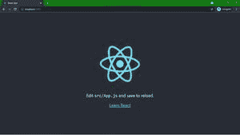
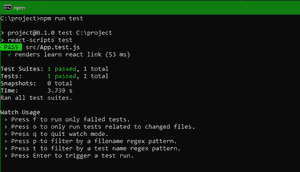

# 使用 create-react-app CLI 有哪些优势？

> 原文:[https://www . geeksforgeeks . org/使用-创建-反应-app-cli/](https://www.geeksforgeeks.org/what-are-the-advantages-of-using-create-react-app-cli/) 的优势是什么

**简介:**要开始使用任何框架，你需要了解你需要安装的所有文件。有了反应，你就不需要担心这个了。React 将用一个命令安装开始工作所需的所有文件。它将安装所有必要的软件包，您可以立即开始渲染和构建您的项目。

**方法:**使用 create-react-app CLI 可以轻松创建 React 项目。让我们使用创建-反应-应用命令行界面创建一个反应项目。

**优势:**

1.  它帮助您以流畅和简单的方式创建和配置 React 项目。开始开发项目的简单方法。
2.  默认情况下，项目是结构化的。所有组件更改都将在源文件夹中完成。节点模块有单独的文件夹，包中提到了依赖项。Json 文件。
3.  反应脚本包是预装的，它有巴贝尔和网络包配置，让你可以轻松地运行和部署你的项目。默认视图是为您开始构建组件而设置的。
4.  编译器、构建和测试环境是使用此命令设置的。为了测试，已经安装了@testing-library/jest-dom 和@testing-library/react，您可以为您的项目运行测试。

**创建反应项目:**

**步骤 1:** 要创建 react app，需要通过 npx 命令安装 react 模块。使用“Npx”而不是“npm”，因为在应用程序的生命周期中，您只需要一次该命令。在命令提示符下输入以下语句。您可以根据自己的用途选择项目名称。

```jsx
npx create-react-app project_name
```

**步骤 2:** 当您在步骤-1 中运行命令时，您可以看到命令提示符下载了所有必需的文件，并且您的项目正在结构化。创建您的 react 项目后，移动到文件夹中执行不同的操作。

```jsx
cd project_name
```

**项目结构:**运行上述步骤中提到的命令后，如果在编辑器中打开项目，可以看到类似的项目结构，如下图所示。用户创建的新组件或我们将要执行的代码更改将在源文件夹中完成。


项目结构

**运行应用程序的步骤:**打开终端并键入以下命令:

```jsx
npm start
```

**输出:**打开浏览器。默认情况下，它将打开一个运行 localhost 的选项卡(http://localhost:3000/)，您可以看到图像中显示的输出。



默认视图

```jsx
npm run test
```

**输出:**打开你的命令提示符，使用这个命令。它将为您的项目运行测试用例，您可以看到图像中显示的输出。



使用创建-反应-应用命令行界面轻松开始您的反应项目。