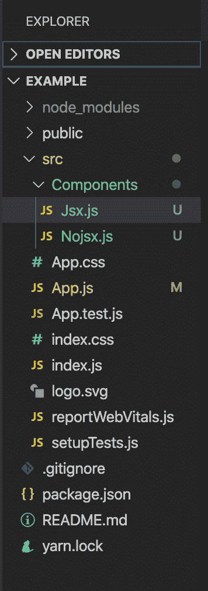

# 在 ReactJS 中使用 JSX 有什么优势？

> 原文:[https://www . geeksforgeeks . org/使用-jsx-in-reactjs/](https://www.geeksforgeeks.org/what-are-the-advantages-of-using-jsx-in-reactjs/) 有何优势

JavaScript XML 或 JSX 是 JavaScript 语言语法的扩展。React 库是为元素和组件编写类似 XML 的代码的扩展。JSX 标签有标签名、属性和子标签。

虽然 JSX 并不是编写 React 应用程序的必要条件，但它非常有益，因为它使 React 代码变得更加简单和优雅。

**JSX 有以下优势:**

*   在编写大块代码时，JSX 帮助我们保持代码简单和优雅**。**
*   **根据 React 文档，当在 JavaScript 代码中使用用户界面时，大多数人发现它作为视觉辅助工具很有帮助。**
*   **JSX 还允许 React 显示更多有用的错误和警告信息。**
*   **如果你熟悉 HTML，那么在构建 React 应用程序时使用 JSX 是非常容易的**
*   **比普通的 JavaScript 更快，因为它在翻译成普通的 JavaScript 时会执行优化。**

****创建反应应用程序:****

*   ****步骤 1:** 使用以下命令创建一个反应应用程序:**

    ```jsx
    npx create-react-app example
    ```

*   ****步骤 2:** 创建项目文件夹后，例如**，**使用以下命令移动到该文件夹:**

    ```jsx
    cd example
    ```

*   ****第三步:**新建一个名为 Components 的文件夹，创建文件***Nojsx.js*** 和 ***Jsx.js*** 。**

****项目结构:**项目结构如下图。**

****

****实现:**在 *App.js、Nojsx.js* 和 *Jsx.js* 文件中写下以下代码。**

## **App.js**

```jsx
import React from 'react';

import Jsx from './Components/Jsx' 
import Nojsx from './Components/Nojsx' 

export default function App() {
  return (
    <div className="App">
     <Jsx/>
     <Nojsx/>
    </div>
  );
}
```

## **诺 jsx.js**

```jsx
import React from 'react'

const Nojsx = () => {
    return React.createElement(
        'div',
        {id:'Nojsx',className : 'GfgClass'},
        React.createElement('h1',null, 'Welcome to GFG')
    )
}

export default Nojsx
```

## **Jsx.js(联合王国)**

```jsx
import React from 'react'

const Jsx = () => {
    return (
        <div className ='GfgClass'>
        <h1>Welcome to GFG</h1>
        </div>
    )
} 

export default Jsx
```

****运行应用程序的步骤:**从项目的根目录使用以下命令运行应用程序:**

```jsx
npm start
```

****输出:**现在打开浏览器，转到***http://localhost:3000/***，会看到如下输出:**

**

输出** 

****结论:**两种成分会产生相同的结果。我们可以得出结论，用 JSX 编写组件代码比不用 JSX 编写要简单得多。**

****参考:**T2】https://reactjs.org/docs/introducing-jsx.html**