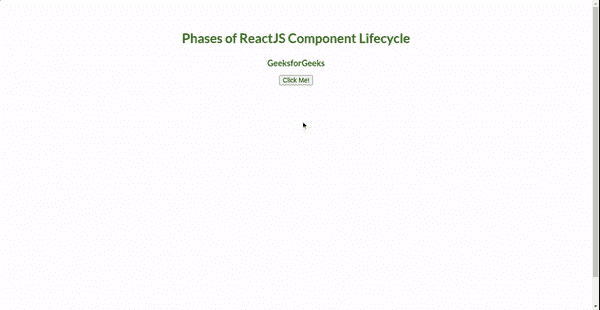

# ReactJS 组件生命周期的不同阶段是什么？

> 原文:[https://www . geeksforgeeks . org/reactjs 组件生命周期的不同阶段是什么/](https://www.geeksforgeeks.org/what-are-the-different-phases-of-reactjs-component-lifecycle/)

**生命周期方法:**在 ReactJS 中，每个组件的开发都涉及到使用不同的生命周期方法。用于创建这样的组件的所有生命周期方法一起构成了组件的生命周期。它们被定义为在组件的不同阶段调用的一系列功能。生命周期组件的每个阶段都包括一些与特定阶段相关的特定生命周期方法。反应性组件的生命周期主要包括 4 个阶段，如下所示。

1.  正在初始化
2.  增加
3.  更新
4.  卸载

**第一阶段:初始化**

这是 React 组件生命周期的初始阶段。顾名思义，这个阶段包括所有的声明、定义和初始化属性、默认道具以及开发人员所需的组件的初始状态。在基于类的组件中，这是在组件的构造函数中实现的。这个阶段在整个生命周期中只出现一次。该阶段包括的方法有:

*   **getDefaultProps():** 在组件被创建或父组件的任何道具被传递到所述(子)组件之前立即调用的方法。用于指定道具的默认值。
*   **getInitialState():** 组件创建前立即调用的方法，用于指定状态的默认值。

**第 2 阶段:安装**

React 组件生命周期的第二个阶段是安装阶段，接下来是初始化阶段。当组件位于 DOM 容器上(意味着组件的一个实例被创建并插入到 DOM 中)并呈现在网页上时，它就开始了。它由两种方法组成，即:

*   **componentWillMount():** 在组件定位到 DOM 之前调用的方法，即在组件第一次呈现在屏幕上之前调用的方法。
*   **componentDidMount():** 组件在 DOM 上定位后立即调用的方法，即组件第一次呈现在屏幕上后立即调用的方法。

**阶段 3:更新**
ReactJS 组件生命周期的第三阶段是更新阶段。接下来是装载阶段，它更新在初始化阶段声明和初始化的状态和属性(如果需要任何更改的话)。它还负责处理用户交互和在组件层次结构中传递数据。与初始化阶段不同，这个阶段可以重复多次。属于这一类别的一些生命周期方法如下:

*   **组件将接收道具():**在已安装组件的道具被重新分配之前立即调用的方法。它接受新的道具，这些道具可能/可能与原始道具不同。
*   **shouldComponentUpdate():** 决定是否需要在网页上显示新渲染的道具之前调用的方法。这在那些要求不要在屏幕上显示新道具的场景中非常有用。
*   **componentWillUpdate():** 在更新状态和/或属性后重新呈现组件之前立即调用的方法。
*   **componentdupdate():**在更新状态和/或属性后重新呈现组件后立即调用的方法。

**阶段 4:卸载**
卸载是 ReactJS 组件生命周期的最后一个阶段。这个阶段包括当组件从 DOM 容器中分离时使用的那些生命周期方法(意味着组件的实例被销毁并从 DOM 中卸载)。它还负责执行所需的清理任务。一旦卸载，组件就不能再重新装载。

*   **component willuunt():**在组件最后从 DOM 中移除之前立即调用的方法，即在组件从页面中完全移除时调用的方法，这显示了其生命周期的结束。

**示例:创建反应应用程序:**

*   **步骤 1:** 使用以下命令创建新的 react 应用程序:

    ```jsx
    npx create-react-app demo-app
    ```

*   **步骤 2:** 使用以下命令进入项目目录:

    ```jsx
    cd demo-app
    ```

**示例:**现在在 App.js 文件中写下以下代码。

## App.js

```jsx
import React, { Component } from "react";

class App extends Component {
  constructor(props) {
    super(props);
    this.state = { myState: "GeeksforGeeks" };
    this.changeMyState = this.changeMyState.bind(this);
  }
  render() {
    return (
      <div style={{ textAlign: "center", marginTop: "5%", color: "#006600" }}>
        <h1>Phases of ReactJS Component Lifecycle</h1>
        <h3> {this.state.myState}</h3>
        <button onClick={this.changeMyState}>Click Me!</button>
      </div>
    );
  }

  componentWillMount() {
    console.log("Phase 2: MOUNTING -> Component Will Mount!");
  }

  componentDidMount() {
    console.log("Phase 2: MOUNTING -> Component Did Mount!");
  }

  // Changing in state 
  changeMyState() {
    this.setState({
      myState: "GeeksforGeeks Tutorial on Phases of ReactJS Lifecycle Methods!",
    });
  }

  // Props  receiver function 
  componentWillReceiveProps(newProps) {
    console.log("Phase 3: UPDATING -> Component Will Receive Props!");
  }

  shouldComponentUpdate(newProps, newState) {

    // Phase 3: UPDATING
    return true;
  }

  // Updation of component 
  componentWillUpdate(nextProps, nextState) {
    console.log("Phase 3: UPDATING -> Component Will update!");
  }

  componentDidUpdate(prevProps, prevState) {
    console.log("Phase 3: UPDATING -> Component Did update!");
  }

  // Unmount of component 
  componentWillUnmount() {
    console.log("Phase 3: UNMOUNTING -> Component Will unmount!");
  }
}

export default App;
```

**运行文件:**您可以保存该文件，然后使用以下命令在**本地主机:3000** 上本地运行您的应用程序:

```jsx
npm start
```

**输出:**

