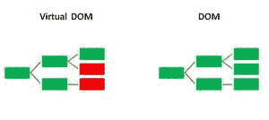
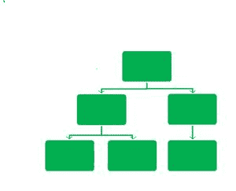
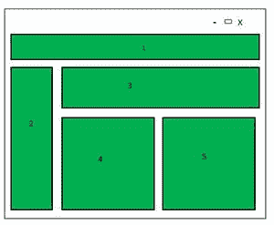
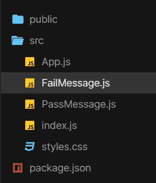
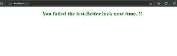

# ReactJS 有哪些特点？

> 原文:[https://www . geeksforgeeks . org/reactjs 的特性是什么/](https://www.geeksforgeeks.org/what-are-the-features-of-reactjs/)

React 是一个由脸书创建的 JavaScript 库，用于创建动态和交互式应用程序，并为网络和移动应用程序构建更好的 UI/UX 设计。React 是一个开源的、基于组件的前端库。React 负责 UI 设计。React 通过将代码划分为组件，使代码更容易调试。

### 反应的特点:

*   JSX (JavaScript 语法扩展)
*   虚拟 DOM
*   单向数据绑定
*   表演
*   扩展ˌ扩张
*   条件语句
*   成分
*   简单

让我们详细了解它们。

**1。JSX(JavaScript 语法扩展):**JSX 是 HTML 和 JavaScript 的结合体。您可以在 HTML 元素中嵌入 JavaScript 对象。浏览器不支持 JSX，因此[巴贝尔编译](https://www.geeksforgeeks.org/reactjs-using-babel/) r 将代码转换成 JavaScript 代码。JSX 让代码变得简单易懂。如果你知道 HTML 和 JavaScript，那就很容易学会了。

```jsx
const name="GeekforGeeks";
const ele = <h1>Welcome to {name}</h1>;
```

**2。** **虚拟 DOM:** DOM 代表[文档对象模型](https://www.geeksforgeeks.org/dom-document-object-model/)。它是网络最重要的部分，因为它分成模块并执行代码。通常，JavaScript 框架会一次更新整个 DOM，这使得网络应用程序运行缓慢。但是 react 使用的是虚拟 DOM，它是真实 DOM 的精确副本。每当 web 应用程序发生修改时，首先会更新整个虚拟 DOM，并找出真实 DOM 和虚拟 DOM 的区别。一旦它发现了差异，那么 DOM 只更新最近发生变化的部分，一切都保持不变。



在上图中，当整个虚拟 DOM 更新后，子组件发生了变化。所以，现在 DOM 找到了区别，只更新了改变的部分。

**3。单向数据绑定:**单向数据绑定，名字本身就说是单向流。react 中的数据仅沿一个方向流动，即数据从上到下传输，即从父组件传输到子组件。子组件中的属性(道具)不能将数据返回到其父组件，但它可以与父组件通信，根据提供的输入修改状态。这就是单向数据绑定的工作过程。这使得一切模块化和快速。



单向数据绑定

如上图所示，数据只能从上到下流动。

**4。** **性能:**正如我们之前讨论的，react 使用虚拟 DOM，只更新修改过的部分。所以，这使得 DOM 运行得更快。DOM 在内存中执行，所以我们可以创建单独的组件，这使得 DOM 运行得更快。

**5。扩展:** React 有很多扩展，我们可以用它们来创建成熟的 UI 应用程序。它支持移动应用程序开发，并提供服务器端渲染。React 用 Flux、Redux、React Native 等扩展。这有助于我们创建好看的 UI。

**6。条件语句:** JSX 允许我们写条件语句。浏览器中的数据根据 JSX 内部提供的条件显示。

**语法:**

```jsx
const age = 12;
if (age >= 10)
{ 
    <p> Greater than { age } </p>;
} 
else 
{ 
    <p> { age } </p>;
}
```

**7。组件:** React.js 将网页分为多个组件，因为它是基于组件的。每个组件都是用户界面设计的一部分，它有自己的逻辑和设计，如下图所示。因此，用 JavaScript 编写的组件逻辑使它变得容易，运行速度更快，并且可以重用。



多个组件

**8。简单性:** React.js 是基于组件的，使得代码可重用，React.js 使用了 HTML 和 JavaScript 相结合的 JSX。这使得代码易于理解和调试，并且代码更少。

让我们通过创建一个应用程序来看看 react.js 是如何工作的。

按照以下步骤创建 react 应用程序:

**步骤 1:** 使用以下命令创建一个 react 应用程序:

```jsx
npx create-react-app foldername
```

**步骤 2:** 将您的目录更改为新创建的文件夹。

```jsx
cd foldername
```

**项目结构:**项目结构创建如下:



**步骤 3:** 现在在 **src** 文件夹中创建新文件为 **PassMessage.js** ，并添加以下代码。

## java 描述语言

```jsx
import React from 'react'
import App from './App';

function PassMessage() {
    return ( 
        <div>
             <h1 style = {
              {
                textAlign: 'center',
                color: 'green'
              }
            }> Congratulations!!!You passed the test. </h1>  
        </div>
    )
}

export default PassMessage
```

**步骤 4:** 现在在 **src** 文件夹中创建另一个文件作为 **FailMessage.js** ，并添加以下代码。

## java 描述语言

```jsx
import React from 'react'
import App from './App'

function FailMessage() {
    return ( 
        <div >
            <h1 style = {
            { textAlign: 'center', 
            color: 'green' } 
            }> You failed the test.Better luck next time..!! </h1> 
        </div>
    )
}

export default FailMessage
```

**第五步:**现在在 **App.js.** 中添加以下代码

## java 描述语言

```jsx
import PassMessage from './PassMessage';
import FailMessage from './FailMessage';

function App(props) {
    const isPass = props.isPass;
        if (isPass) {
            return <PassMessage/> ;
        }
    return <FailMessage/> ;
};

export default App;
```

**第六步:**在 **index.js** 中添加以下代码。

## java 描述语言

```jsx
import React from 'react';
import ReactDOM from 'react-dom';
import App from './App';
import FailMessage from './FailMessage';
import PassMessage from './PassMessage';

ReactDOM.render( <App isPass = { true }/>, 
              document.getElementById('root'));
```

**运行应用程序的步骤:**打开终端，键入以下命令。

> npm 启动

### 输出:

如果您在 **index.js** 中给出 **isPass={true}** 的值，那么它将给出以下输出:


如果 **index.js** 中**的值为 isPass={false}** ，则显示以下输出。

