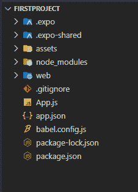

# 创建第一个 React Native App 有哪些步骤？

> 原文:[https://www . geeksforgeeks . org/什么是创建-第一反应-原生-应用/](https://www.geeksforgeeks.org/what-are-the-steps-to-create-first-react-native-app/)

React Native 是由 Meta Platforms，Inc .创建的开源 UI 软件框架，用于为 Android、Android TV、iOS 等开发应用。我们一直在寻求更短的开发周期、更快的部署时间和更好的应用性能。还有很多混合移动框架，比如 NativeScript、React Native、ion、Xamarin、PhoneGap 等等。

**React Native:** 这是一个由脸书开发的框架，用于在一种通用语言 JavaScript 下为 iOS &安卓系统创建本地风格的应用程序。最初，脸书只开发了 React Native 来支持 iOS。然而，随着最近对安卓操作系统的支持，该库现在可以为两个平台渲染移动用户界面。

使用 React Native 构建非常高效，并且非常容易上瘾，但是开始可能有点棘手。React Native 使用一个 JavaScript 运行时 Node.js 来构建您的 JavaScript 代码。如果你还没有安装 Node.js，那么是时候获取它了！

**安装:**在这里，我们将使用 Expo CLI 版本，它将更加流畅地运行您的 React Native 应用程序。按照以下步骤逐一设置您的 React 原生环境。

**Expo:** It 是通用 React 应用的框架和平台。它是一套围绕 React Native 和原生平台构建的工具和服务，可帮助您从相同的 JavaScript/TypeScript 代码库中开发、构建、部署和快速迭代 iOS、安卓和网络应用程序。

**第一步:**打开你的终端，运行下面的命令。

```
npm install -g expo-cli
```

**步骤 2:** 现在 expo-cli 已经全局安装，因此您可以通过运行下面的命令来创建项目文件夹。

```
expo init "projectName"
```

**步骤 3** :现在进入创建的文件夹，使用以下命令启动服务器。

```
cd "projectName"
```

执行反应原生程序

```
npm start web
```

**项目结构:**



**示例:**在这个示例中，我们简单地渲染一个文本，在文本上放置一些样式，比如文本颜色。

## App.js

```
import React from "react";
import { Text, View, StyleSheet } from "react-native";

const App = () => {
  return (
    <View style={styles.container}>
      <Text style={styles.paragraph}>
          Welcome to React-Native
      </Text>
      <Text style={styles.para}>
        This is your first React Native Program Geek!!!
      </Text>
    </View>
  );
};

export default App;

const styles = StyleSheet.create({
  container: {
    flex: 1,
    justifyContent: "center",
    padding: 8,
    backgroundColor: "white",
  },
  paragraph: {
    marginTop: "40%",
    marginLeft: 20,
    color: "green",
    textAlign: "center",
    fontWeight: "bold",
    fontSize: 30,
  },
  para: {
    marginLeft: 20,
    color: "red",
    textAlign: "center",
    fontWeight: "bold",
  },
});
```

**输出:**

