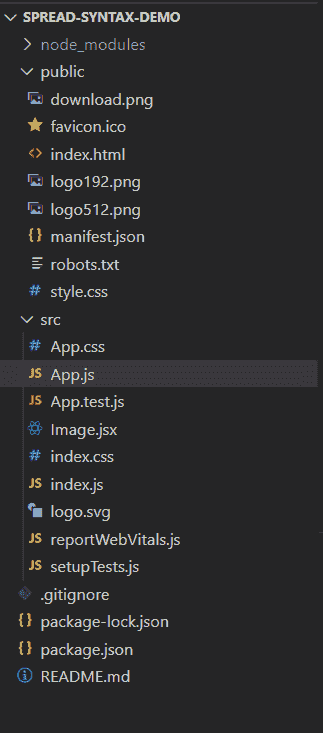

# React 中的这三个点(…)是做什么的？

> 原文:[https://www . geesforgeks . org/what-do-this-dot-in-react-do/](https://www.geeksforgeeks.org/what-do-these-three-dots-in-react-do/)

被称为扩展语法的三点(…)符号在很长一段时间内一直是 React 的一部分，当时它可以通过 transpilation 使用，尽管它已经成为 JavaScript 的一部分，成为 ES2015 语法的一部分。

Spread 语法用于将一个数组或对象分解成单独的变量，在这些变量中，数组中元素的确切数量可能是未知的，或者当我们希望将一个属性或一组属性与整个对象分开时。

可以使用扩展语法执行以下操作:

**1。传递属性:**对象可以直接传递给组件，而不是单独传递对象中的每个数据值。

```
values:{
    height: 20,
    width: 10
}

<Image {...values} source="Image_Source">

// This same as the following:
<Image height={values.height} 
width={values.width} source="Image_Source">
```

**2。继承对象:**创建继承另一个对象的新对象时，我们可以使用扩展语法来继承父对象。

```
object1:{
    a: 10,
    b: 20
};

object2:{
    ...object1,
    c: 14
};
```

**3。连接数组:**我们还可以使用扩展语法连接数组，如下所示。

```
var first =[1, 2, 3];
var second = [2, 3, 4, 5];
var third = [...first, ...second];
```

**4。析构数组:**也可以使用扩展语法将数组析构为独立的组件。

```
var original = [1,2,3,4,5,6,7];
var [first, ...remaining] = original;

// Therefore the following will be the values of first and remaining.
first = [1]  
remaining = [2,3,4,5,6,7]
```

**创建反应应用程序并安装模块:**

*   **步骤 1:** 使用以下命令创建一个反应应用程序:

    ```
    npx create-react-app spread-syntax-demo
    ```

*   **第 2 步:**创建项目文件夹**后，**使用以下命令移动到该文件夹:

    ```
    cd spread-syntax-demo
    ```

**项目结构:**如下图。



**示例:**这里在 App.js 文件中，我们要创建一个对象，从中创建一个子对象，然后将其作为属性传递给一个组件。

## App.js

```
import React from 'react';
import Image from './Image.jsx';

function App(props) {
  const originalImage = { src:
"https://media.geeksforgeeks.org/wp-content/cdn-uploads/gfg_200x200-min.png",
    alt:"This is a random image"
  };

  const formattedImage = {
    ...originalImage,
    height:300,
    width: 300
  }
  return (
    <div>
      <Image {...formattedImage}/>
    </div>
  );
}

export default App;
```

在 Image.jsx 中，我们使用扩展语法将道具传递给 HTML img 标签。

## Image.jsx

```
import React from 'react';

function Image(props) {
    return (
        <div>
            
        </div>
    );
}

export default Image;
```

**运行应用程序的步骤:**从项目的根目录使用以下命令运行应用程序:

```
npm start
```

**输出:**现在打开浏览器，转到***http://localhost:3000/***，会看到如下输出:

