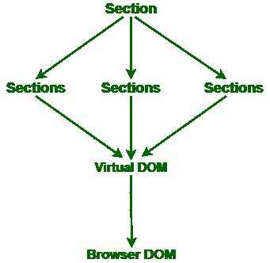
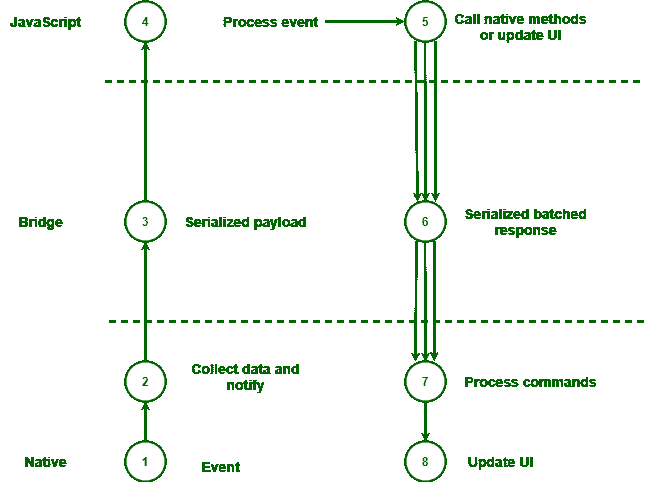

# 什么是反应原生中的桥梁？

> 原文:[https://www . geesforgeks . org/什么是反应中的桥-原生/](https://www.geeksforgeeks.org/what-is-a-bridge-in-react-native/)

反应原生应用程序包括如下所示的两个**面。**

1.  **JavaScript 端**
2.  **原生侧**

原生端应该是安卓的 Java 或 Kotlin，iOS 的 Swift 或 Objective-C。

React Native 流行的巨大原因是可以在 JavaScript 代码和 Native 语言之间建立一座桥梁。React Native 是以一种我们可以在 JavaScript 代码和本机语言之间建立桥梁的方式开发的。反应原生中的桥允许 JavaScript 代码和原生代码相互交互。如果没有 React Native 中的桥，那么本机代码绝对没有办法向 JavaScript 代码传输任何信息，反之亦然。

**React Native 中桥的需求:**假设我们需要重新利用一些现有的 Java 库，而不需要在 JavaScript 中再次实现它。因此，我们可以在我们的 React Native 应用程序中使用本机桥来重新利用它。有时，为了构建一个生产级的应用程序，我们很可能需要使用本机桥。

**桥的工作方式:**当我们点击应用图标打开应用时，操作系统会设计主线程(也称为用户界面线程)，并将该线程分配给我们的应用。这个主线程创建了 JavaScript 线程和影子线程(也称为影子树)。影子线程的任务是计算 JavaScript 端描述的布局，并将细节重定向到 Native 端。视图在 JavaScript 中设置，在影子树中计算，并重定向到用户界面线程。

**调度数据:**现在我们知道了一开始是如何描述布局的，但是应用程序开始运行后会发生什么？当我们需要损坏按钮时会发生什么？这个细节是通过桥发送的吗？

为了削弱一个按钮，我们可以在 JavaScript 端设置一个特性，它将像序列化的 JSON 对象一样被重定向到桥的上方。对本机视图的改进被同时分组，并在事件循环的所有迭代结束时在本机端被重定向。

除了传递属性，我们还可以传递一个函数，该函数将运行 JavaScript 代码，作为对本机端几个事件的反应(例如按下按钮)。我们注意到 JavaScript 中的这个回调，它被序列化并重定向到本机端。当我们按下按钮时，本机事件被重定向到 JavaScript 域，并执行回调。现在，我们还可以将事件从本机端直接重定向到 JavaScript 端，而无需使用回调。问题是，如果我们在本机端开始这种交互，那么我们就不知道谁在关注 JavaScript 端，这会激活不需要的步骤，并使我们的代码难以调试。利用 JS 端的回调更有意义，除非有明确的理由不这样做。

**执行:**大多数时候，所有的事情都在稳步进行，然而有时就像一座原始的桥一样，它会造成交通堵塞。当有一个很大的物品目录，我们开始快速滚动，然后我们可能会在其他物品被传送之前识别出一个空白屏幕。发生这种情况是因为 onScroll 本机事件被重定向到 JavaScript 线程，JavaScript 线程将新的布局细节传输到影子树，影子树计算布局并重定向到本机端。在快速滚动的同时，我们收集了这些导致桥上交通堵塞的事件。我们可以尝试通过预先计算布局来避免这种情况，以便几次过桥。在执行复杂的动画时，我们可以获得类似的执行问题。

现在让我们深入探索并认识到 React Native 在幕后是如何工作的，这将有助于我们理解 JavaScript 编译为 Native 代码以及整个过程的工作原理。认识到整个过程是如何工作的是非常重要的，因此有时如果您有性能问题，那么您将认识到这个问题的来源。

**信息流:**正如我们已经讨论过的，React 的想法可以激活 React Native，其中之一就是 UI 是数据的函数。您可以转换条件，并对需要更新的内容做出反应。现在让我们假设细节是如何随着通常的 React 应用程序流动的。浏览下面给出的图表:

**上图说明:**

1.  我们有一个 React 部分，它将详细介绍三个子部分。
2.  匿名发生的事情是生成一个虚拟 DOM 树，构成这些部分层次结构。
3.  当父部分的条件被更新时，React 注意到如何对子部分进行细节处理。
4.  由于子元素主要是用户界面的描述，React 意识到如何对浏览器 DOM 更新进行分组并实现它们。

现在让我们分离浏览器 DOM，并假设 React Native 通过调用 Native 模块来做同样的事情，而不是对浏览器 DOM 更新进行分组。因此，可以通过以下两种方式对本机模块进行详细介绍:

1.  **共享可变数据**
2.  【JavaScript 和本机模块之间互换的可序列化消息

React Native 使用第二种方法，即在 JavaScript 和 Native 模块之间互换的 Serializable 消息。它不会改变可共享对象上的数据，而是将异步序列化的分组消息传递到 React Native 桥。React Native 中的桥是允许 JavaScript 代码和 Native 代码相互交互的层。

**架构:**下图解释了 React Native 架构的结构:

**反应原生架构**

上图中陈述了三层:

1.  **JavaScript**
2.  **桥**
3.  **原生**

React Native 中的桥是允许 JavaScript 和 Native 模块相互交互的层，并且主要是从 JavaScript 到 Native 模块传导非平行时间分组反馈消息的载体层。在上面给出的图片中，自然层显示在最后，因为该层离设备本身最近。

当事件在本机层实现时，它可能是计时器、触摸或网络请求，主要是与设备本机模块相关联的任何事件。它的数据被组装，并且该数据作为序列化消息被发送到 React Native 桥。之后，网桥将该消息传送到 JavaScript 层。

JavaScript 层是一个事件循环。在反应本地桥将序列化的有效负载传送到 JavaScript 之后，事件被处理，应用程序逻辑变为活动的。

**线程模型:**现在，在完成了我们上面讨论的所有事情之后，认识到上面讨论的所有事情都是在三个主要线程上完成的是有意义的:

1.  用户界面(应用程序的主线程)
2.  本机模块
3.  JavaScript 运行时

让我们了解一下上面的每一个线索:

*   **UI(应用程序的主线程):**它是原生线程，在这里进行原生级别的感知，也是我们的选择平台(如 iOS 或 Android)进行绘图、造型和测量的地方。

*   **本机模块:**如果应用程序访问任何本机应用程序接口，则访问在不同的本机模块线程上完成。例如，如果访问了相机、位置、照片和任何进一步的本机应用编程接口，那么通常在这个线程上也得出安排和指示。

*   **JavaScript 运行时:**是每个 JavaScript 应用程序代码都会运行的线程。毕竟它基于一个 JavaScript 事件循环，所以比 UI 线程更稳定。因此，当在进行许多用户界面更改的应用程序中进行复杂的计算时，可能会导致性能下降。