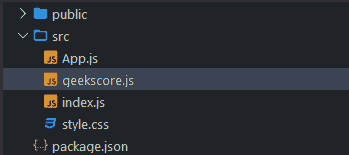
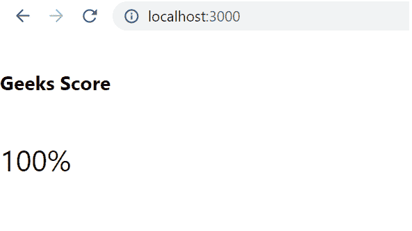

# ReactJS 中什么是纯功能成分？

> 原文:[https://www . geeksforgeeks . org/什么是纯功能组件 in-reactjs/](https://www.geeksforgeeks.org/what-is-a-pure-functional-component-in-reactjs/)

**什么是 JavaScript 函数？**

一个 JavaScript 函数是一个代码块，它被设计用来执行一个特定的任务，这个任务在被调用时被执行。

【React 功能组件如何类似于 JavaScript 函数？

从概念上讲，组件就像 JavaScript 函数。一个函数组件是一个在 React 中返回 JSX 的 JavaScript 函数。这些函数接受任意输入(通常称为“道具”)，并返回描述屏幕上应该出现什么的 React 元素。

**当反应组分是纯的？**

如果返回值仅由其输入值决定，并且对于相同的输入值，返回值总是相同的，则称函数是纯函数。

如果一个 React 组件为相同的状态和道具呈现相同的输出，那么它就被认为是纯的。对于反应纯类组件，反应提供了纯组件基类。扩展反应的类组件。PureComponent 类被视为纯组件。

**创建反应应用程序:**

*   **步骤 1:** 使用以下命令创建一个反应应用程序:

    ```jsx
    npx create-react-app pure-react
    ```

*   **步骤 2:** 创建项目文件夹(即纯反应)后，使用以下命令移动到该文件夹:

    ```jsx
    cd pure-react
    ```

**项目结构:**如下图。



**文件名:App.js**

## App.js

```jsx
import React from 'react';
import GeeksScore from './geekscore';

export default function App() {
  return (
    <div>
      <GeeksScore score="100" />
    </div>
  );
}
```

## geekscore . js

```jsx
import React from 'react';

class GeeksScore extends React.PureComponent {

  render() {
    const { score, total = Math.max(1, score) } = this.props;

    return (
      <div>
        <h6>Geeks Score</h6>
        <span>{ Math.round(score / total * 100) }%</span>
      </div>
    )
  }

}

export default GeeksScore;
```

**运行应用程序的步骤:**从项目的根目录使用以下命令运行应用程序:

```jsx
npm start
```

**输出:**现在打开浏览器，转到***http://localhost:3000/***，会看到如下输出:



**为什么是纯成分？**

纯组件有一些性能改进和渲染优化，因为 React 为它们实现了 shouldComponentUpdate()方法，对道具和状态进行了简单的比较。

**什么是 React 中的纯功能成分？**

功能组件在 React 中非常有用，尤其是当我们想要将状态管理从 React 组件中分离出来时。这就是为什么它们经常被称为无状态组件。

然而，功能组件不能利用 **React 带来的性能改进和渲染优化。PureComponent** 因为根据定义它们不是类。

优化一个功能组件，以便 React 可以将其视为一个纯组件，不一定需要将该组件转换为类组件。为了在 React 中创建一个纯功能组件，React 提供了一个 **React.memo()** API。使用 **React.memo()** API，可以如下包装 React 功能组件，得到 React 纯功能组件。

**react . memo()API 的一些重要内容有:**

*   **React.memo()** 是一个高阶组件，它以 React 组件作为其第一个参数，并返回一个纯 React 组件。
*   使用 **React.memo()** 返回的 React 组件类型允许渲染器在记忆输出的同时渲染组件。
*   **React.memo()** 也可以使用 ReactDOMServer 与组件 w 配合使用。

## App.js

```jsx
import React from 'react';
import GeeksScore from './geekscore';

export default function App() {
  return (
    <div>
      <GeeksScore score="100" />
    </div>
  );
}
```

## geekscore . js

```jsx
import React, { memo } from 'react';

function GeeksScore({ score = 0, total = Math.max(1, score) }) {
  return (
    <div>
      <h2>Geeks Score</h2>
      <span>{ Math.round(score / total * 100) }%</span>
    </div>
  )
}

export default memo(GeeksScore);
```

**运行应用程序的步骤:**从项目的根目录使用以下命令运行应用程序:

```jsx
npm start
```

**输出:**现在打开浏览器，转到***http://localhost:3000/***，会看到如下输出:

