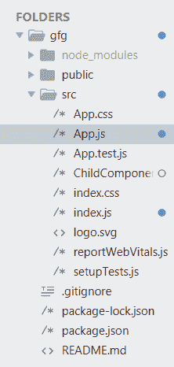
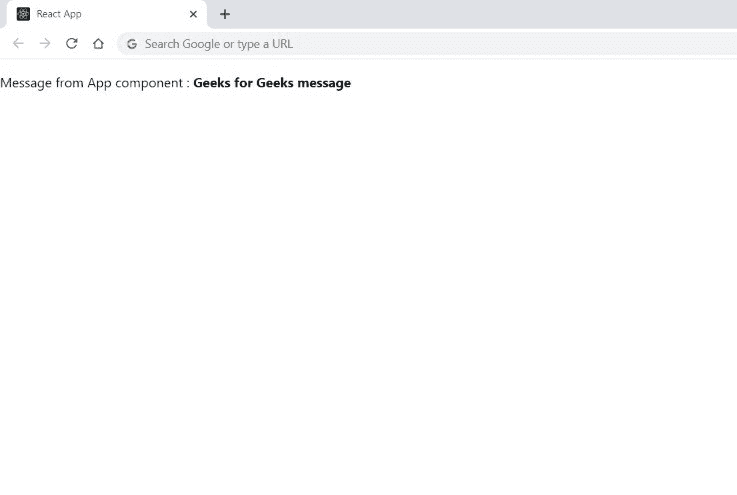

# 什么是 React 中的组件继承？

> 原文:[https://www . geesforgeks . org/什么是组件-继承-in-react/](https://www.geeksforgeeks.org/what-is-components-inheritance-in-react/)

**继承**是一个在面向对象编程中起主要作用的概念。这是一种允许对象具有先前对象上已经存在的属性的技术。

**存在的两类是:**

*   超类(父类)
*   子类(子类)

在 React 中，使用组合模型而不是继承，因此代码可以在组件之间再次重用。在 react **扩展**关键字是上使用的主函数即构造函数。通过使用 extends 关键字，您可以让当前组件拥有现有组件的所有组件属性。构图模型通过传递状态和道具来使用超子类关系。子类段可以访问彼此之间的任何进展。

**创建反应应用程序:**

*   **步骤 1:** 在终端/命令提示符下使用以下命令创建 React 应用程序:

    ```jsx
    create-react-app foldername
    ```

*   **步骤 2:** 创建项目文件夹(即文件夹名)后，使用以下命令移动到该文件夹:

    ```jsx
    cd foldername
    ```

**项目结构:**如下图:



项目结构

这里有两个组件，即 *AppComponent* 和一个 *ChildComponent* ，子组件接管所有的 app 属性。

**示例:**现在在 App.js 文件中写下以下代码。在这里，App 是我们编写代码的默认(父)组件。在下面的代码中， *this.state.message* 被传递给 ChildComponent。

## App.js

```jsx
import logo from './logo.svg';
import React from 'react';
import './App.css';
import ChildComponent from "./ChildComponent";

class App extends React.Component {
    constructor(props) {
        super(props);
        this.state = {
            message: " Geeks for Geeks message"
        };
    }

    render() {
        return (
            <div>
                <ChildComponent message={this.state.message} />
            </div>
        );
    }
}
export default App;
```

现在在 ChildComponent.js 文件中写下以下代码。子组件接受所有应用组件属性。

## ChildComponent.js

```jsx
import React from "react";

class ChildComponent extends React.Component {
    render() {
        const { message } = this.props;
        return (
            <div>
              <p> Message from App component : <b>{message}</b> </p>
            </div>
        );
    }
}

export default ChildComponent;
```

**运行应用程序的步骤**:从项目根目录使用以下命令运行应用程序:

```jsx
npm start
```

**输出:**



子组件访问的应用程序组件属性