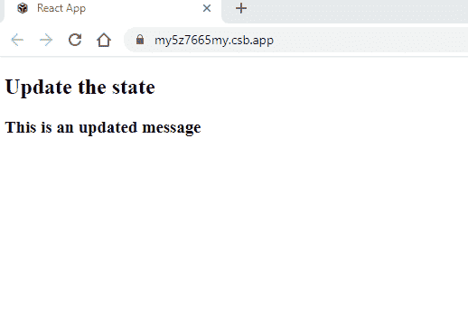
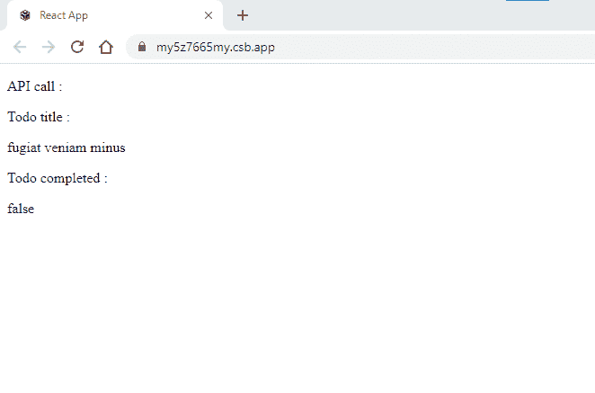

# 什么是 ReactJS 中的 ComponentWillMount()方法？

> 原文:[https://www . geesforgeks . org/what-is-component will mount-method-in-reactjs/](https://www.geeksforgeeks.org/what-is-componentwillmount-method-in-reactjs/)

React 需要几个组件来表示特定功能的逻辑单元。当涉及到更新业务逻辑、应用程序配置更新和 API 调用时，componentWillMount 生命周期挂钩是一个理想的选择。

componentWillMount()生命周期挂钩主要用于在实际呈现发生之前实现服务器端逻辑，例如对服务器进行 API 调用。方法允许我们在组件被加载或装载到文档对象模型中时同步执行反应代码。此方法在反应生命周期的安装阶段调用。

ComponentWillMount()通常用于在加载组件或从服务器获取数据时显示加载器。

#### 特点:

*   它允许我们在向最终用户显示内容之前修改内容，这给最终用户留下了更好的印象，否则，任何内容都可以向最终用户显示。
*   因为它是一个 react 系统定义的方法，如果我们想通过编写任何自定义函数来实现相同的功能，那么它将无法为我们提供与 React 生命周期相同的性能，因此它被优化了。

#### 语法:

*   在执行任何活动之前，他们首先要调用的是构造函数，然后调用 componentWillMount()函数。
*   在这个函数中，我们可以执行一些重要的活动，比如为最终用户修改 HTML 视图等。
*   下一件事将被调用来呈现，因为我们已经在 componentWillMount()部分做了一些修改，更改后的值将显示在用户端。

## java 描述语言

```jsx
componentWillMount() {
    // Perform the required 
    // activity inside it
}

// Call the render method to 
// display the HTML contents.
render(){
}
```

**创建反应应用程序:**

**步骤 1:** 运行以下命令创建一个新项目

```jsx
npx create-react-app my-app
```

**第二步:**上面的命令将创建应用程序，您可以使用下面的命令运行它，并且可以在浏览器中查看您的应用程序。

```jsx
cd my-app
npm start
```

**项目结构:**如下图


**App.js** :现在在 App.js 文件中写下下面的代码。在这里，App 是我们编写代码的默认组件。

**ComponentWillMount 操作 State():** 生命周期钩子 ComponentWillMount()在初始渲染前触发，该函数在组件的生命周期内只触发一次。一旦组件被启动，当前的状态值将被更新的值覆盖，但是请记住，这在组件的生命周期中只发生一次。最后一步是在 render()函数中打印消息，如下所示。

## java 描述语言

```jsx
import React, { Component } from "react";

class App extends Component{
constructor() {
    super();
    this.state = {
      message: "This is initial message"
    };
}

render() {
    return (
      <div>
        <h2>Update the state</h2>
        <h3>  {this.state.message} </h3>

      </div>
    );
}
};

export default App;
```

**解释:**当我们运行上面的例子时，一旦组件启动，消息变量的值就会更新；这是操作业务逻辑的标准方式。

**输出:**



**ComponentWillMount()进行 API 调用:** componentWillMount()是在组件启动后进行 API 调用，并将值配置成状态。要进行 API 调用，可以使用诸如 Axios 之类的 HttpClient，或者我们可以使用 fetch()来触发 AJAX 调用。具有 fetch() API 调用的函数如下所示。fetch()与虚拟 API URL 一起使用，后者命中服务器并获取数据；最后，响应被更新为状态变量 todo，它包含对象。从 API 得到响应后，我们可以按照需求消费数据。下面是一个完整的例子

**虚拟 API URL:**https://jsonplaceholder . tipcode . com/all/3

## java 描述语言

```jsx
import React, { Component } from "react";

class ApiCall extends Component {
  constructor() {
    super();
    this.state = {
      todo: {}
    };
  }

  componentWillMount() {
    fetch("https://jsonplaceholder.typicode.com/todos/3")
      .then(response => response.json())
      .then(json => {
        this.setState({ todo: json });
      });
  }

  render() {
    const { todo } = this.state;
    console.log(todo)
    return (
      <div>
        <p>API call :</p>

        Todo title : <p>{todo.title}</p>

        Todo completed : 
        <p>{todo.completed === true ? "true" : 
                            "false"}</p>
      </div>
    );
  }
}

export default ApiCall;
```

**输出:**



**注意:**与其他生命周期方法不同，更改组件内部的状态值将不会一次又一次地重新运行组件。