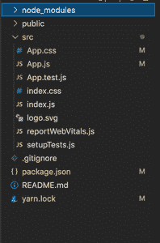
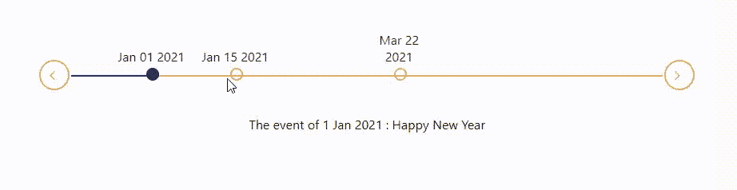

# ReactJS 中的水平时间轴是什么？

> 原文:[https://www . geeksforgeeks . org/什么是水平时间线 in-reactjs/](https://www.geeksforgeeks.org/what-is-horizontal-timeline-in-reactjs/)

**水平时间线**是以水平方式描述某一时间点某一事件的时间线或线图。假设在给定的时间或日期发生了三个事件。

<figure class="table">T21T27T30】板考 考试

| **date** | **event** |
| January 1(st), 2021 | New Year |
| January 15(th), 2021 | festival | March 22(nd), 2021 |

</figure>

然后我们可以在水平时间线中表示它，如下所示:

```jsx
---(1 Jan 2021)----(15 Jan 2021)-----(22 Mar 2021)----

OnClick of 1 Jan we will show the event.    

    The event of 1 Jan 2021 : Happy New Year

OnClick of 15 Jan we will show the event.

    The event of 15 Jan 2021 : Festival

OnClick of 22 Mar we will show the event.

    The event of 22 March 2021 : Board Exam
```

**创建反应应用程序并安装模块:**

*   **步骤 1:** 使用以下命令创建一个 React 应用程序。

    ```jsx
    npx create-react-app foldername
    ```

*   **步骤 2:** 创建项目文件夹(即文件夹名)后，使用以下命令移动到该文件夹。

    ```jsx
    cd foldername
    ```

*   **步骤 3:** 创建 ReactJS 应用程序后，使用以下命令安装 react-水平时间线。

    ```jsx
    npm i react-horizontal-timeline
    ```

*   **步骤 4:** 现在，使用以下命令安装道具类型。

    ```jsx
    npm i prop-types
    ```

**项目结构:**如下图。



项目结构

**示例:**现在在 App.js 文件中写下以下代码。在这里，App 是我们编写代码的默认组件。

## App.js

```jsx
import React, { useState } from "react";
import HorizontalTimeline from "react-horizontal-timeline";
import "./App.css";

function App() {
  const [value, setValue] = useState(0);
  const [previous, setPrevious] = useState(0);

  // Values should be only date
  const VALUES = ["2021-01-01", "2021-01-15", "2021-03-22"];

  // Description array corresponding to values
  const description = [
    "The event of 1 Jan 2021 : Happy New Year",
    "The event of 15 Jan 2021 : Festival",
    "The event of 22 March 2021 : Board Exam",
  ];

  return (
    <div className="root-div">
      <div style={{ width: "60%",
                    height: "100px", 
                    margin: "0 auto" }}>
        <HorizontalTimeline
          styles={{ outline: "#DFA867", foreground: "#19295C" }}
          index={value}
          indexClick={(index) => {
            setValue(index);
            setPrevious(value);
          }}
          values={VALUES}
        />
      </div>
      <div className="text-center">{description[value]}</div>
    </div>
  );
}

export default App;
```

## App.css 文件

```jsx
.text-center{
   text-align: center;
}

.root-div{
  margin-top: 150px;
}
```

**运行应用程序的步骤:**从项目的根目录使用以下命令运行应用程序。

```jsx
npm start
```

**输出:**现在打开浏览器，转到***http://localhost:3000/***，会看到如下输出。



**参考:**T2】https://www.npmjs.com/package/react-horizontal-timeline