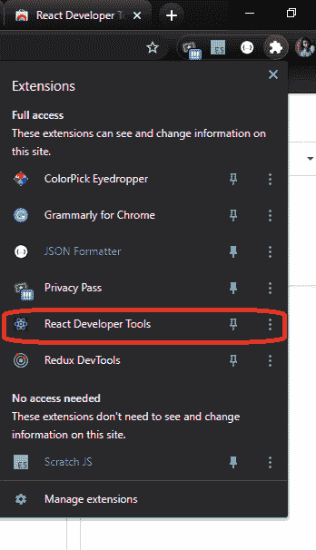

# 什么是 React 开发者工具？

> 原文:[https://www.geeksforgeeks.org/what-is-react-developer-tool/](https://www.geeksforgeeks.org/what-is-react-developer-tool/)

反应开发工具是反应 JavaScript 库的 Chrome 开发工具扩展。如果您正在处理 React.js 应用程序，这是一个非常有用的工具。这个扩展将 React 调试工具添加到 Chrome 开发工具中。它帮助您检查和编辑构建页面的 React 组件树，对于每个组件，您可以检查道具、状态、钩子等。

React Developer 工具还可以帮助您了解在特定的应用程序中是否使用过 React.js。火狐中也有。

### 如何添加扩展名？

跟随链接[反应开发者工具](https://chrome.google.com/webstore/detail/react-developer-tools/fmkadmapgofadopljbjfkapdkoienihi?hl=en)

1.  点击**添加到 Chrome** 。
2.  该工具已添加到您的 Chrome。
3.  转到顶部右侧的扩展选项卡，单击它。在下拉列表中，可以看到已经添加了扩展。

要删除扩展名，您必须点击**从 Chrome** 中删除。

### 如何使用扩展？

**检测应用是否使用 React.js**

打开要检查的应用程序，现在单击扩展选项卡，然后单击反应开发工具。如果扩展仍然是彩色的，这意味着它是用 React.js 构建的；如果扩展是无色的，这意味着应用程序没有使用 React.js

**检查和编辑反应组件**

在应用程序上，右键单击，从下拉菜单进入**检查**或键入 **Ctrl+Shift+I.** 它打开 **Chrome 开发工具**，现在在顶部栏上单击双箭头，下拉菜单将像这样打开。

点击**组件**，反应组件树将出现。

在这里，人们可以检查、编辑道具、状态、了解结构。

同样，点击 **Profiler** 。

单击探查器将允许您记录性能信息。