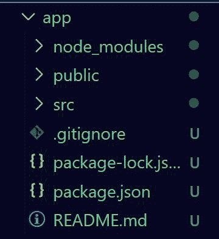
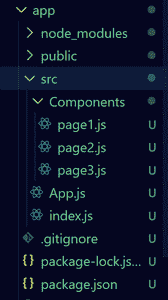
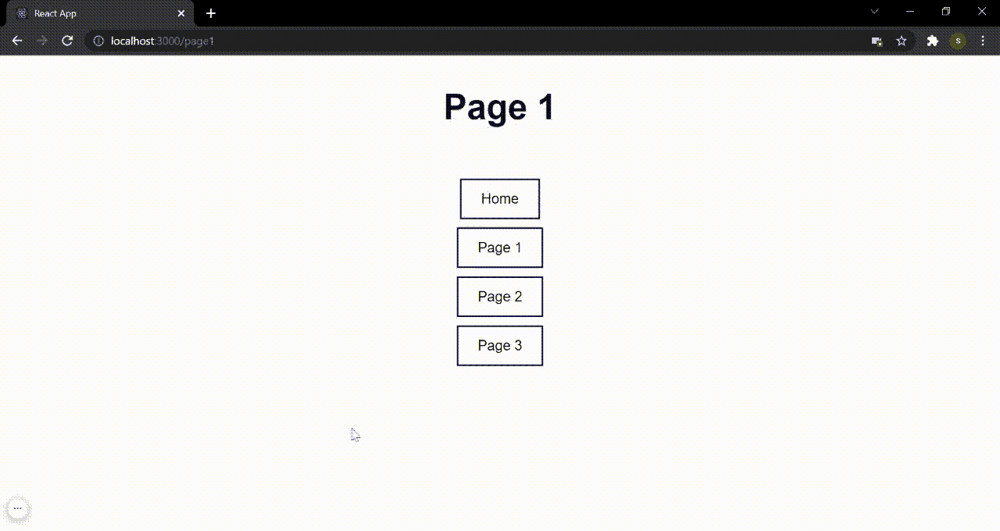

# 什么是 react-router-dom？

> 原文:[https://www.geeksforgeeks.org/what-is-react-router-dom/](https://www.geeksforgeeks.org/what-is-react-router-dom/)

React Router DOM 是一个 npm 包，它使您能够在 web 应用程序中实现动态路由。它允许您显示页面并允许用户导航它们。它是 React 的一个功能齐全的客户端和服务器端路由库。React Router Dom 用于构建单页应用程序，即具有许多页面或组件但页面从不刷新的应用程序，而是根据 URL 动态获取内容。这个过程被称为路由，它是在 React Router Dom 的帮助下实现的。

react-router 的主要优点是，例如，当点击另一个页面的链接时，页面不必刷新。此外，它是快速的，非常快相比传统的页面导航。这意味着用户体验更好，app 整体性能更好。

React Router Dom 有许多有用的组件，要创建功能齐全的路由，您需要其中的大部分。

1.  **路由器(通常作为浏览器导入):**它是用于存储所有其他组件的父组件。其中的所有内容都将是路由功能的一部分
2.  **Switch:** Switch 组件用于仅渲染与位置匹配的第一条路线，而不是渲染所有匹配的路线。
3.  **路由:**该组件检查当前 URL，并显示与该确切路径相关联的组件。所有路由都位于交换机组件内。
4.  **链接:**链接组件用于创建到不同路线的链接。

路由组件采用两个参数。第一个是 url 中的路径，第二个是当前 URL 与第一个参数中的路径匹配时显示的组件。

**示例:**下面是一个例子，我们使用 react Router Dom 创建了一个简单的 React 应用。该应用程序将包含 4 页。即 1 个主页和 3 个样本页面。用户将在路由和链接的帮助下在这些页面之间导航。

**下面是分步实施:**

**步骤 1:** 使用以下命令创建一个反应应用程序:

```
npx create-react-app foldername
```

**步骤 2:** 创建项目文件夹(即文件夹名)后，使用以下命令移动到该文件夹:

```
cd foldername
```

**项目结构:**你的项目目录可能是这样的。



我们将在 **src** 文件夹中的**应用程序、js** 文件中完成大部分工作。

**步骤 3:** 接下来，使用以下命令安装 react 路由器 dom

```
npm install react-router-dom
```

**步骤 4:** 现在，在 src 中创建新文件夹，名为 Components。在此文件夹中，创建 3 个文件:

1.  第 1 页，js
2.  第 2 页，js
3.  第 3 页，js

向所有页面添加以下代码:

## 第 1 页，js

```
import React from 'react'

export default function Page1() {
    return (
        <div>
            <h1>Page 1</h1>
        </div>
    )
}
```

## 第 2 页，js

```
import React from 'react'

export default function Page2() {
    return (
        <div>
            <h1>Page 2</h1>
        </div>
    )
}
```

## 第 3 页，js

```
import React from 'react'

export default function Page3() {
    return (
        <div>
            <h1>Page 3</h1>
        </div>
    )
}
```

**项目结构:**现在看起来如下。



项目目录

**第五步:**现在，在 App.js 里面导入演示所需的组件，然后在 App.js 里面添加下面的代码，这里我们首先导入 3 个页面，然后在路由器里面添加一个 Switch。在交换机内部，添加了 4 条路由，一条用于主页，3 条用于其他页面。该列表包含用户可以点击导航的可点击链接。

## App.js

```
import { BrowserRouter as Router, Route, Link, Switch} 
        from "react-router-dom";

// Import the pages

import Page1 from "./Components/page1"
import Page2 from "./Components/page2"
import Page3 from "./Components/page3"

// Import css
import "./app.css"

function App() {
  return (
    <div className="App">
      <Router>
        <Switch>
          <Route exact path="/" element={<h1>Home Page</h1>} />
          <Route exact path="page1" element={<Page1 />} />
            <Route exact path="page2" element={<Page2 />} />
          <Route exact path="page3" element={<Page3 />} />
        </Switch>
        <div className="list">
          <ul>
            <li><Link to="/">Home</Link></li>
            <li><Link to="page1">Page 1</Link></li>
            <li><Link to="page2">Page 2</Link></li>
            <li><Link to="page3">Page 3</Link></li>
          </ul>
        </div>
      </Router>
    </div>
  );
}
export default App;
```

**第六步:**你可以使用下面的 CSS 来改进设计，让 app 更有表现力。将它添加到 App.css(如果它还不存在，请创建它)。

## App.css 文件

```
* {
    padding: 0;
    margin: 0;
}

h1 {
    text-align: center;
    font-size: 45px;
    font-family: Arial, Helvetica, sans-serif;
    color: rgb(6, 0, 32);
    padding: 40px;
}

.list {
    display: flex;
    justify-content: center;
    width: 100%;
}

.list ul li {
    list-style: none;
    margin: 42px;
    text-align: center;
}

a {
    text-decoration: none;
    color: rgb(0, 0, 0);
    font-size: 18px;
    font-family: Arial, Helvetica, sans-serif;
    padding: 14px 25px;
    background-color: transparent;
    border: 2px solid rgb(12, 0, 66);
}

a:hover {
    background-color: rgb(12, 0, 66);
    color: rgb(255, 255, 255);
}
```

**运行应用程序的步骤:**打开终端，键入以下命令。

```
npm start
```

**输出:**

