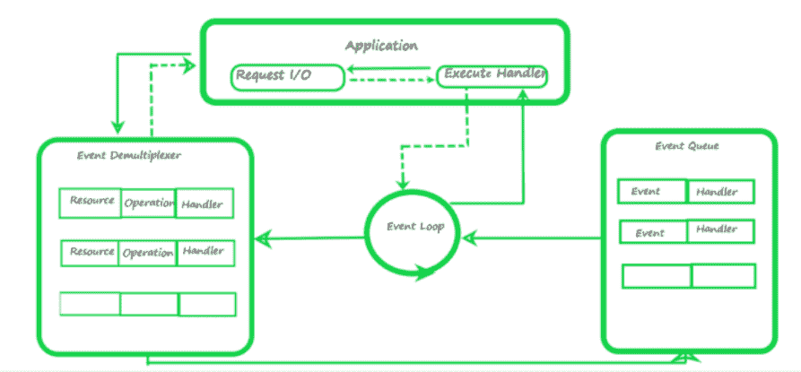

# node . js 中的反应器模式是什么？

> 原文:[https://www . geesforgeks . org/what-is-reactor-pattern-in-node-js/](https://www.geeksforgeeks.org/what-is-reactor-pattern-in-node-js/)

**反应器模式**用于避免输入/输出操作的阻塞。它为我们提供了一个与输入输出操作相关的处理程序。当要生成输入/输出请求时，它们被提交给多路分解器，多路分解器处理并发性以避免输入/输出模式的阻塞，并以事件的形式收集请求并将这些事件排队。

**I/O 操作有两种执行方式:**

1.  **阻塞 I/O:** 应用程序将进行函数调用，并在某一点暂停其执行，直到收到数据。它被称为“同步”。
2.  **非阻塞输入输出:**应用程序将进行函数调用，并且不等待结果就继续执行。它被称为“异步”。

**注意:** Node.js 本质上是异步的。

**反应器模式包括:**

1.  **资源:**它们由多个应用程序共享，用于 I/O 操作，通常执行速度较慢。
2.  **同步事件解复用器/事件通知器:**这使用事件循环来阻塞所有资源。当一组输入/输出操作完成时，事件多路分解器将新事件推入事件队列。
3.  **事件循环和事件队列:**事件队列将发生的新事件及其事件处理程序对排队。
4.  **请求处理程序/应用程序:**这通常是为资源上注册的事件提供要执行的处理程序的应用程序。

**反应堆模式是如何工作的？**

1.  一切都从应用程序开始。它发出一个请求，事件多路分解器收集这些请求，然后形成称为事件队列的队列。
2.  事件解复用器由 libuv 运行，libuv 是一个允许 JavaScript 代码(通过 V8)执行 I/O、网内、文件等的库。它是一个异步 IO 库，允许 Node.js 执行 I/O
3.  在上图中，只有一个事件队列和 7 个基本队列。这些队列具有升序优先级，具有最高优先级的队列首先被事件循环检查。
4.  计时器队列具有最高优先级。setTimeout 和 setInterval 函数在这里排队。一旦事件在这个队列中完成，或者时间到了，事件循环就将这些函数传递给调用堆栈，称为执行处理程序。
5.  当其中一个事件队列完成时，事件循环将首先检查其他两个队列，这两个队列对其他微任务和被称为 nextTick 函数的进程进行排队，而不是跳转到下一个队列。然后它会跳到即将到来的队列。

*回调队列是事件队列，调用栈是执行处理程序。*