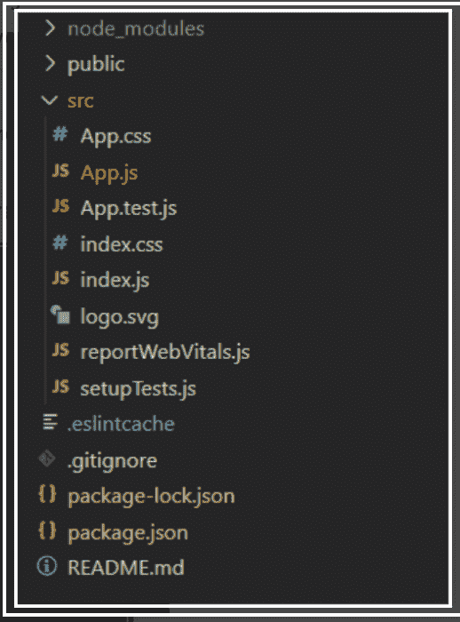

# 什么是 ReactJS 中的有状态/基于类的组件？

> 原文:[https://www . geesforgeks . org/什么是基于状态类的组件 in-reactjs/](https://www.geeksforgeeks.org/what-is-stateful-class-based-component-in-reactjs/)

**[React 基于类的组件](https://www.geeksforgeeks.org/reactjs-class-based-components/) :** 这些是大多数内置于 ReactJS 的现代网络应用的基础。这些组件是简单的类(由向应用程序添加功能的多个函数组成)。所有基于类的组件都是 ReactJS 的组件类的子类。一旦声明了一个组件，它就可以在其他组件中使用。

**创建反应应用程序:**

**步骤 1:** 使用以下命令执行 Create react app。

```jsx
npx create-react-app foldername
```

**步骤 2:** 通过执行以下命令将目录更改为该文件夹:

```jsx
cd foldername
```

**项目结构:**如下图。



**示例 1:** 演示基于类的组件创建的程序。

## App.js

```jsx
import React from "react";

class App extends React.Component {
  render() {
    return <h1> Welcome to GeeksForGeeks</h1>;
  }
}

export default App;
```

**运行应用程序的步骤:**打开终端，键入以下命令。

```jsx
npm start
```

**输出:**


**[类组件中的状态](https://www.geeksforgeeks.org/reactjs-state-react/) :** 基于类的组件区别于功能组件的主要特征是，它们可以访问规定组件当前行为和外观的状态。状态是反应组件类的一个实例，可以定义为控制组件行为的一组**可观察的**属性的一个对象。换句话说，组件的状态是一个对象，它保存着一些可能在组件生命周期内发生变化的信息。例如，让我们想到我们在本文[](https://www.geeksforgeeks.org/reactjs-rendering-elements/)<u>中创建的时钟，我们每秒都在显式调用 render()方法，但是 React 提供了一种更好的方法来实现相同的结果，那就是使用 State，将时间值存储为组件状态的一个成员。我们将在本文后面更详细地探讨这一点。可以通过调用 setState()函数来修改此状态。一次可以使用 setState()函数修改一个或多个定义为状态一部分的变量、数组或对象。</u>

<u>**示例 2:** 演示在基于类的组件中使用状态和道具的程序。打开 App.js 文件，用下面的代码替换代码。</u>

## <u>App.js</u>

```jsx
import React from "react";

class App extends React.Component {
constructor(props) {
    super(props);
    this.state = { change: true };
}
render() {
    return (
    <div>
        <button
        onClick={() => {
            this.setState({ change: !this.state.change });
        }}
        >
        Click Here!
        </button>
        {this.state.change ? (
        <h1>Welcome to GeeksforGeeks</h1>
        ) : (
        <h1>A Computer Science Portal for Geeks</h1>
        )}
    </div>
    );
}
}

export default App;
```

<u>**输出:**</u>

<u></u>

<u>**[类组件中的道具:](https://www.geeksforgeeks.org/reactjs-props-set-1/)** 数据借助道具传递给其他组件。道具对 ReactJS 中的所有组件都有类似的作用，无论它们是基于类的还是功能性的。道具总是从父组件传递到子组件。ReactJS 通常不允许组件修改自己的道具。修改道具的唯一方法是将父组件传递的道具更改为子组件。这通常是通过传递对父组件中的函数的引用来完成的，这将改变传递给子组件的道具。我们可以使用上面的语法从组件类内部访问任何 prop。“this.props”是一种存储所有组件道具的全局对象。*道具名称*，也就是道具的名称是这个物体的钥匙。</u>

<u>**示例 3:** 演示道具在基于类的组件中的使用的程序。打开 App.js 文件，用下面的代码替换代码。</u>

## <u>App.js</u>

```jsx
import React from "react";
class Name extends React.Component{

    render() {
        return(
        <div>
     <h1>{this.props.data}</h1>

        </div>
        )
    }
    }

class PropsExample extends React.Component {
    constructor(props) {
        super(props);
        this.state = { change: true };
    }
render() {
    return (
    <div>
        <button
        onClick={() => {
            this.setState({ change: !this.state.change });
        }}
        >
        Click Here!
        </button>
        {this.state.change ? (
        <Name data="Welcome to GeeksforGeeks" />
        ) : (
        <Name data="A Computer Science Portal for Geeks" />
        )}
    </div>
    );
}
}

export default PropsExample;
```

<u>**输出:**</u>

<u></u>