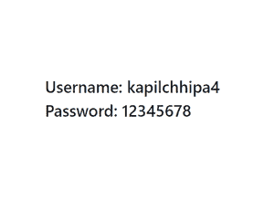

# 在 React 中使用构造函数和 getInitialState 有什么区别？

> 原文:[https://www . geeksforgeeks . org/使用构造函数-vs-getinitialstate-in-react/](https://www.geeksforgeeks.org/what-is-the-difference-between-using-constructor-vs-getinitialstate-in-react/)的区别是什么

React 中的构造函数和 getInitialState 都用于初始化状态，但它们不能互换使用。这两者的区别在于，当我们使用 ES6 类时，应该在构造函数中初始化状态，而当我们使用 React.createClass (ES5 语法)时，应该定义 getInitialState 方法。所以构造函数和 getInitialState 的区别就是 ES6 和 ES5 本身的区别。

我们使用**getinitialistate**和 React.createClass，使用**构造函数**和 React.Component。

**语法:**

```
class App extends React.Component {
constructor(props) {
  super(props);
  this.state = { /* initial state */ };
}
}
```

**语法:**

```
var App = React.createClass({
getInitialState() {
  return { /* initial state */ };
},
});
```

上述两种初始化状态的语法是等价的。

**创建反应应用程序:**

**步骤 1:** 使用以下命令创建一个反应应用程序:

```
npx create-react-app foldername
```

**步骤 2:** 创建项目文件夹(即文件夹名称)后，使用以下命令移动到该文件夹:

```
cd foldername
```

**项目结构:**如下图。


**使用构造函数初始化状态:**

## java 描述语言

```
import {React ,Component} from 'react'
class App extends Component{

  constructor(props) {
    super(props);
    this.state = {
      username: "kapilchhipa4",
      password: "12345678"
    }
  }

  render() {  
    return (
      <div>
      <h3>Username: {this.state.username}</h3>
      <h3>Password: {this.state.password}</h3>
      </div>
      ) 
  }
}

export default App
```

**使用 getInitialState 方法初始化状态:**

**注意:**我们需要使用以下命令安装一个库来使用 createReactClass 方法:

```
npm install create-react-class --save
```

## java 描述语言

```
import { React } from 'react'

var App = React.createClass({

  getInitialState() {
    return { 
      username: 'kapilchhipa4',
      password:'12345678'
    };
  },

  render() {
    return (  
      <div>
        <h3>Username: {this.state.username} </h3>
      </div>
    )
  }
});

export default App
```

**输出:**

