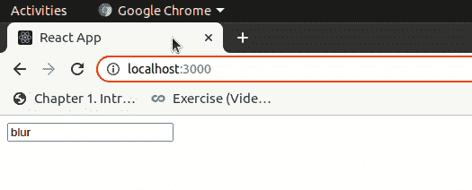

# document . getelementbyid()在 React 中的等价形式是什么？

> 原文:[https://www . geeksforgeeks . org/document-getelementbyid-in-react/](https://www.geeksforgeeks.org/what-is-the-equivalent-of-document-getelementbyid-in-react/)的等效物是什么

在 React 中我们有一个 Refs 的概念，它相当于 Javascript 中的 document.getElementById()。引用提供了一种访问在呈现方法中创建的 DOM 节点或反应元素的方法。

**创建参考文献**

引用是使用 React.createRef()创建的，并通过 Ref 属性附加到 React 元素。

```
class App extends React.Component {
 constructor(props) {
   super(props);
   //creating ref
   this.myRef= React.createRef();
 }
 render() {
 //assigning ref
   return <div ref={this.myRef} />;
 }
}
```

**访问参考文献**

当我们在渲染中给一个元素分配一个引用时，我们可以使用引用的当前属性来访问这个元素。

```
const node = this.myRef.current;
```

**创建反应应用程序:**

**步骤 1:** 使用以下命令创建一个反应应用程序:

```
npx create-react-app foldername
```

**步骤 2:** 创建项目文件夹(即文件夹名)后，使用以下命令移动到该文件夹:

```
cd foldername
```

**项目结构:**如下图。


**文件路径- src/App.js:**

## java 描述语言

```
import React from 'react'

class App extends React.Component {

    constructor(props) {
        super(props);
        this.myRef = React.createRef();
      }
    onFocus() {
      this.myRef.current.value ="focus"
    }

    onBlur() {
      this.myRef.current.value = "blur"
    }

    render() {
      return (
        <div>
          <input
            ref= {this.myRef}
            onFocus={this.onFocus.bind(this)}
            onBlur={this.onBlur.bind(this)}
          />
        </div>
      );
    }
  }

  export default App;
```

**输出:** 