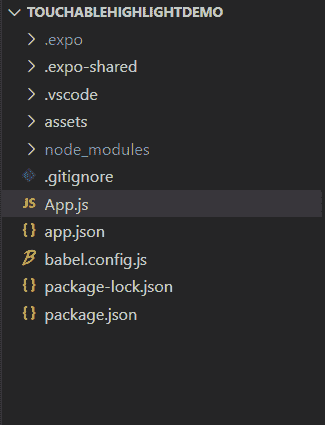

# react native 中的 TouchableHighlight 是什么？

> 原文:[https://www . geesforgeks . org/what-the-touchable highlight-in-react-native/](https://www.geeksforgeeks.org/what-is-the-touchablehighlight-in-react-native/)

TouchableHighlight 是一个组件，用于为视图提供包装，以使它们正确响应基于触摸的输入。按下 TouchableHighlight 组件时，其不透明度会降低，这允许基础视图或其他组件的样式高亮显示。

此组件必须只有一个子组件。如果有多个子组件，则将它们包装在视图组件中。TouchableHighlight 必须有一个子组件。

**语法:**

```jsx
<TouchableHighlight>
    // Child Component
</TouchableHighlight>
```

**触地得分推进剂:**

*   **onPress:** 用于指定释放触摸时调用的功能。
*   **禁用:**如果其值为真，禁用所有交互。默认值为“假”。
*   **样式:**用于指定 TouchableHighlight 组件的样式
*   **活动不透明度:**用于指定触摸活动时包裹视图的不透明度值。它采用 0 到 1 之间的值，默认值为 0.85。
*   **底层颜色:**用于指定触摸激活时显示的底层颜色。

**现在我们从实现开始:**

*   **步骤 1:** 打开终端，通过以下命令安装 expo-cli。

    ```jsx
    npm install -g expo-cli
    ```

*   **步骤 2:** 现在通过以下命令创建一个项目。

    ```jsx
    expo init TouchableHighlightDemo
    ```

*   **第三步:**现在进入你的项目文件夹，即 TouchableHighlightDemo

    ```jsx
    cd TouchableHighlightDemo
    ```

**项目结构:**如下图:



**示例:**现在让我们实现 TouchableHighlight。在下面的示例中，我们有一个按钮，当用户单击它时，将演示 TouchableHighlight 功能。

## App.js

```jsx
import React from 'react';
import { StyleSheet,
         Text, 
         View, 
         TouchableHighlight, 
         Alert } from 'react-native';

export default function App() {
  return (
    <View style={styles.container}>

      <TouchableHighlight onPress={() => {
        Alert.alert("Touchable Highlight pressed.");
      }}
        style={styles.touchable}
        activeOpacity={0.5}
        underlayColor="#67c904"
      >
        <Text style={styles.text}>Click Me!</Text>
      </TouchableHighlight>
    </View>
  );
}

const styles = StyleSheet.create({
  container: {
    flex: 1,
    backgroundColor: '#fff',
    alignItems: 'center',
    justifyContent: 'center',
  },
  touchable: {
    height: 50,
    width: 200,
    borderRadius: 10,
    alignItems: 'center',
    justifyContent: 'center',
    backgroundColor: '#4287f5'
  },
  text: {
    color: "#fff"
  }
});
```

使用以下命令启动**服务器**。

```jsx
npm run android
```

**输出:**如果你的模拟器没有自动打开，那么你需要手动打开。首先，去你的安卓工作室运行模拟器。现在再次启动服务器。


**参考:**T2】https://reactnative.dev/docs/touchablehighlight