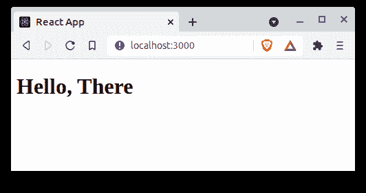
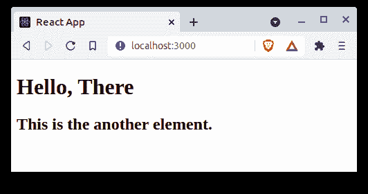
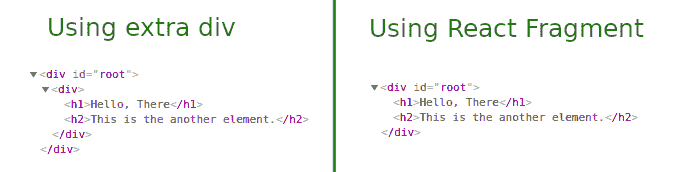

# 片段在 React 中有什么用？

> 原文:[https://www . geesforgeks . org/什么是反应中碎片的用途/](https://www.geeksforgeeks.org/what-is-the-use-of-fragment-in-react/)

在 ReactJS 中，我们借助返回语句从组件中呈现 JSX，无论该语句是写在功能组件中还是写在类组件的呈现函数中。现在重点是在 javascript 中，return 语句只能返回一个实体，所以当我们必须从 return 语句中返回多个元素时，我们通常会创建额外的节点。这个额外的节点有一些缺点，因此为了避免它们，我们使用了反应片段。

**先决条件:**如何启动和创建 react app 的知识、react 中的 JSX 以及 HTML DOM 的基础知识。

**组件如何渲染？**

创建 react 应用程序后，在 index.js 和 app.js 中进行以下更改，这里我们只处理这两个文件。index.js 文件是主要的入口点，在其中，App.js 借助 **render** 方法在 DOM 的根 id 处被渲染。App.js 内部只存在一个 h1 标签。

## index.js

```jsx
import React from 'react';
import ReactDOM from 'react-dom';

import App from './App';

ReactDOM.render(<App />, 
    document.getElementById('root'));
```

## App.js

```jsx
import React from 'react';

function App() {
  return (
    <h1>Hello There</h1>
  );
}

export default App;
```

**输出:**



**如果我们必须在 DOM 中的同一级别返回两个不同的元素呢？**

在这种情况下，我们必须使用容器，即 div，否则 React 将通过类似“*相邻 JSX 元素必须包装在一个封闭标签*中”的错误。

## App.js

```jsx
import React from 'react';

function App() {
  return (<div>
    <h1>Hello, There</h1>
    <h2>This is the another element.</h2>
  </div>);
}

export default App;
```

**输出:**



### 反应碎片

它允许我们从组件中返回多个元素，使用它我们可以对子元素列表进行分组。

## App.js

```jsx
import React from 'react';

function App() {
  return (<React.Fragment>
    <h1>Hello, There</h1>
    <h2>This is the another element.</h2>
  </React.Fragment>);
}

export default App;
```

**输出:**


**说明:**虽然输出保持不变但是整个重点是在分组的时候**没有创建任何额外的节点。**有很多[场景](https://reactjs.org/docs/fragments.html#motivation)，在这些场景中，这个额外的 div 会导致我们进入一个有问题的状态，这就是为什么我们总是更喜欢片段进行分组。



**注:**我们也可以用这个 **< > < / >** 的句法糖形式代替 **< React。片段><React.Fragment/>。**