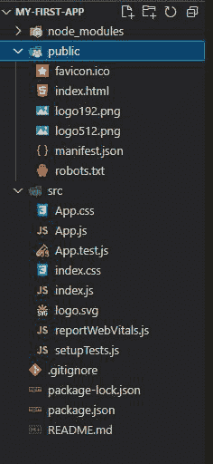
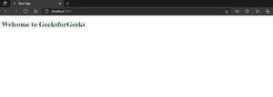

# react . createelement 有什么用？

> 原文:[https://www . geeksforgeeks . org/react-create element/](https://www.geeksforgeeks.org/what-is-the-use-of-react-createelement/)的用途是什么

react 元素描述了实际的[文档对象模型(DOM)](https://www.geeksforgeeks.org/dom-document-object-model/) 元素应该是什么样子。 [React.js](https://www.geeksforgeeks.org/react-js-introduction-working/) 不要直接用浏览器 DOM，而是用虚拟 DOM 设计 UI/UX，和浏览器交互。[虚拟 DOM](https://www.geeksforgeeks.org/reactjs-virtual-dom/) 由反应元素组成。它们看起来类似于 HTML 元素，但它们是 JavaScript 对象。简而言之，react 元素是如何创建浏览器 DOM 的说明。我们使用下面的语法通过在 JavaScript 中嵌入 HTML 元素来创建 react 元素，以便在屏幕上显示内容。

#### **语法:**

```
React.createElement(type,{props},children); 
```

React.createElement()接受三个参数。它们是:

*   **类型:**HTML 元素的类型(h1，p，button)。
*   **道具:**对象的属性({style:{size:10px}}或 Eventhandlers、classNames 等)。
*   **孩子:**任何需要在屏幕上显示的东西。

**React DOM:** React DOM 包含在浏览器中呈现 React 元素所需的参数。

```
ReactDOM.render(element,containerElement);
```

ReactDOM.render()接受两个参数:

*   **元素:**需要在 DOM 中呈现的元素。
*   **container relement:**在 dom 中的何处渲染。

#### 创建一个反应应用程序:

**步骤 1:** 使用以下命令创建一个 react 应用程序:

```
npx create-react-app foldername
```

创建应用程序需要几分钟时间。

**步骤 2:** 创建文件夹后，使用下面提到的命令将目录更改为新创建的文件夹。

```
cd foldername
```

**项目结构:**如下图所示创建项目结构:



项目结构

**步骤 3:** 现在在 **index.js** 文件中添加下面的代码，使用 React.createElement()创建一个 react 元素。

## java 描述语言

```
import React from 'react';
import ReactDOM from 'react-dom';

let demo = React.createElement(
    "h1", { style: { color: "green" } }, "Welcome to GeeksforGeeks"
)
ReactDOM.render(
    demo,
    document.getElementById('root')
);
```

**步骤 4:** 使用以下命令运行应用程序。

```
npm start
```

#### 输出:

输出在浏览器中可见。

