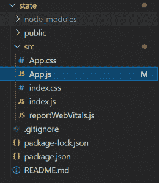
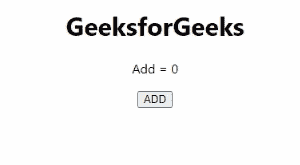

# setElement 函数在 ReactJS 中有什么用？

> 原文:[https://www . geeksforgeeks . org/set element-function-in-reactjs/](https://www.geeksforgeeks.org/what-is-the-use-of-setelement-function-in-reactjs/)的用途是什么

在 [ReactJS](https://www.geeksforgeeks.org/reactjs-tutorials/) 中，我们有一个 [useState Hook](https://www.geeksforgeeks.org/reactjs-usestate-hook/) 这个 Hook 用来声明函数内部的一个状态变量。需要注意的是，useState()的一次使用只能用于声明一个状态变量。

**进场:**

*   创建一个 React 应用程序来设置开发环境。
*   声明一个 useState 钩子。
*   使用 setElement 函数设置元素的值。

**注意:**请参考 [ReactJS 设置](https://www.geeksforgeeks.org/reactjs-setting-development-environment/)一文设置开发环境。

**设置开发环境:**

**步骤 1:** 使用以下命令创建一个反应应用程序:

```jsx
npx create-react-app foldername
```

**步骤 2:** 创建项目文件夹(即文件夹名称)后，使用以下命令移动到该文件夹:

```jsx
cd foldername
```

**注意:**在那个创建的文件夹中，转到 *src* 文件夹，删除 App.test.js、logo.svg 和 setupTests.js，因为这些文件在这个项目中不是必需的，我们的文件夹名是*州*。

**项目结构:**如下图。



项目结构

**语法:**

该 useState 钩子声明如下:

```jsx
const [ element , setElement ] = useState(initial_state);
```

useState()返回的值由一个包含两个值的数组组成。第一个值称为状态变量，第二个值称为改变状态变量状态的函数，这个函数被命名为 *setElement* 。

这个 setElement 函数用于改变第一个变量的状态或值。

**示例:**使用 setElement 函数更改元素的状态。

在 **App.js** 中写下下面给出的代码。

## java 描述语言

```jsx
import React, { useState } from 'react'
function App() {
  const [element, setElement] = useState(0);

  function onClickButtonHandler() {
    setElement(element+1);
  }
  return (
    <div style={{textAlign:"center"}}>
      <h1>GeeksforGeeks</h1>

<p>Add = {element}</p>

      <button onClick={onClickButtonHandler}>
        ADD
      </button>
    </div>
  )
}

export default App;
```

**运行应用程序的步骤:**打开终端，键入以下命令。

```jsx
npm start
```

**输出:**



**注:**请参考 [React Hook](https://www.geeksforgeeks.org/introduction-to-react-hooks/) 文章了解更多。