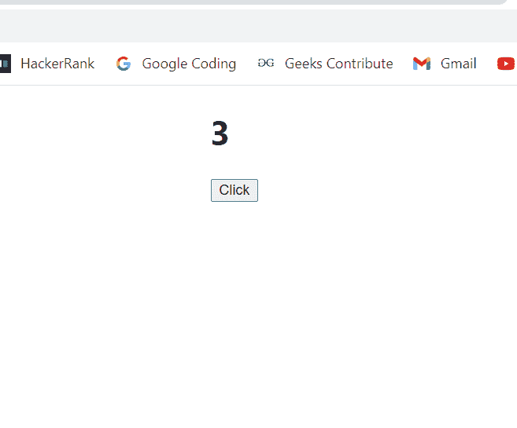

# React 中 useState()是什么？

> 原文:[https://www.geeksforgeeks.org/what-is-usestate-in-react/](https://www.geeksforgeeks.org/what-is-usestate-in-react/)

**useState()** 是一个钩子，允许你在功能组件中有状态变量。React 有两种类型的组件，一种是类组件，是从 React 扩展而来的 ES6 类，另一种是功能组件。类组件一个组件，可以有状态和生命周期方法:类消息扩展反应。useState 钩子是一个特殊的函数，它将初始状态作为参数，并返回一个包含两个条目的数组。

**语法:**第一个元素是初始状态，第二个元素是用于更新状态的函数。

```
const [state, setState] = useState(initialstate)
```

如果需要计算初始状态，我们还可以传递一个函数作为参数。并且该函数返回的值将用作初始状态。

```
const [sum, setsum] = useState(function generateRandomInteger(){5+7);})
```

上述函数是一个计算两个数之和的单线函数，将被设置为初始状态。

**导入:**要使用 useState，需要从 react 导入 useState，如下所示:

```
import React, { useState } from "react"
```

**创建反应应用程序:**

**步骤 1:** 使用以下命令创建一个反应应用程序:

```
npx create-react-app foldername
```

**步骤 2:** 在创建项目文件夹(即文件夹名**)后，使用以下命令将**移动到该文件夹:

```
cd foldername
```

**示例:**下面是 useState()函数的实现。

**App.js**

## java 描述语言

```
import React, { useState } from "react";

function App(props) {
  const [count, setRandomCount] = 
    useState(function generateRandomInteger() {
    return Math.floor(Math.random() * 100);
  });
  function clickHandler(e) {
    setRandomCount(Math.floor(Math.random() * 100));
  }
  return (
    <div style={{margin: 'auto', width: 100, display: 'block'}}>
      <h1> {count} </h1>

      <p>
        <button onClick={clickHandler}> Click </button>
      </p>

    </div>
  );
}

export default App
```

**运行应用程序的步骤:**从项目的根目录使用以下命令运行应用程序:

```
npm start
```

**输出:**



**说明:**首先使用随机函数用随机数初始化计数变量，并用 setRandomCount 更新计数的状态。每次我们点击 onClick 按钮，它都会调用 clickHandler 函数，该函数会用随机数再次设置计数变量。