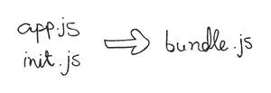
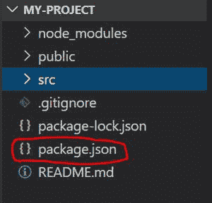
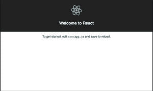
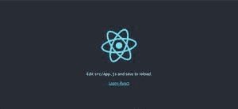

# Create React App 2.0 有什么新功能？

> 原文:[https://www . geesforgeks . org/what-new-in-create-react-app-2-0/](https://www.geeksforgeeks.org/whats-new-in-create-react-app-2-0/)

那些不知道 create-react-app 是 CLI 或命令行界面工具的人可以使用它来生成 react 应用程序，这比你自己设置 web pack 配置要容易得多。

### 包更新:

*   巴别塔 7
*   Webpack 4
*   笑话 23

**Babel:** 浏览器对 JavaScript 现代特性的支持最近变得更好了，但它永远不会完美。我们可以修补聚合文件，或者使用一个小的 shell 脚本来重写我们的代码，但是这些代码很容易被破坏，导致死代码。Babel 是解决这个问题的一种方法，它采用现代的 JavaScript，并将其编译成一种可以在不同环境中理解的形式。Babel 建立在一个插件系统上，该插件系统将我们现代的 JavaScript 解析成抽象语法树或 AST，并将其重写为我们的浏览器可以解释的版本。要进行设置，请安装 babel CLI 包，并将其保存为开发依赖项。

```
npm install --save-dev babel-cli
```

换句话说，它用于编译更新的 es6 plus 特性，以便在所有浏览器中使用。巴别塔的版本 7 比以前的版本更快，因为它增加了一些新功能。

**Webpack:** 它是一个模块构建器，也就是说，Webpack 是我们在代码开发过程中使用的一个工具，在我们的资产运行时使用。Web pack 不仅构建您的代码，还管理您的代码。它允许我们创建出色的 web 应用程序来管理我们所有的风格和 JavaScript 文件，主要但不限于此。

 

Webpack 用于捆绑。

**Jest:** Jest 用于测试，它包括了交互快照模式和自定义匹配等新功能。Jest 使用的项目有:巴贝尔、打字脚本、节点、反应、角度、Vue 等等！

*   create-react-app 的版本 1 集成了 sass，但是还需要做一些额外的配置。在版本 2 中，我们可以简单地安装“node-sass ”,并且可以重命名我们的。所以它使使用 sass 变得更加容易。
*   CSS 的模块允许我们跨不同的文件使用相同的 CSS 类，而不必担心冲突或问题。CSS 模块使用 create react 应用程序开箱即用，因此您可以使用所示的语法导入模块，如**【名称】【module . scss】**或**【名称】【模块. CSS】**。
*   所以除了 sass 集成和 CSS 模块之外，我们还有更小的 CSS 包，我们可以用浏览器列表规范中的 **package.json** 文件来定位现代浏览器。因此，只要有必要，我们可以调整我们的样式，只针对 WebKit 前缀或 MS 前缀。

**package.json:**



```
{
"name": "my-project",
"version": "0.1.0",
"private": true,
"dependencies": {
  "@testing-library/jest-dom": "^4.2.4",
  "@testing-library/react": "^9.5.0",
  "@testing-library/user-event": "^7.2.1",
  "react": "^16.13.1",
  "react-dom": "^16.13.1",
  "react-scripts": "3.4.3"
},
"scripts": {
  "start": "react-scripts start",
  "build": "react-scripts build",
  "test": "react-scripts test",
  "eject": "react-scripts eject"
},
"eslintConfig": {
  "extends": "react-app"
},
"browserslist": {
  "production": [
    ">0.2%",
    "not dead",
    "not op_mini all"
  ],
  "development": [
    "last 1 chrome version",
    "last 1 firefox version",
    "last 1 safari version"
  ]
}
}
```

*   帖子 CSS 也被添加到创建一个反应应用程序。
*   因此，如果您使用过版本 2，您可能首先注意到的是登录页面的变化，它现在看起来更简单、更干净，或者说页面更干净，如下所示:



版本 1



版本 2

*   服务工作者的实现方式也发生了变化版本 2 现在使用谷歌的 workbox，这是一组库，用于缓存离线资产，并以比**SW-precche**更优雅的方式与服务工作者一起工作，这将使我们更容易使用 React 库创建渐进式网络应用程序。
*   现在增加了对使用 express 和全栈应用程序配置我们自己的代理的支持，因此我们可以像使用 HTTP 代理中间件模块一样使用，然后在您的 React 应用程序中的客户机上创建一个文件，就在名为 setupProxy.js 的源文件夹内，而不是像以前那样定义一个代理对象。
*   我们现在可以使用为最新节点版本编写的包。
*   我们现在可以导入一个 SVG 作为一个 React Component，不像以前那样导入一个 SVG 并将其添加到图像的源属性中，但是现在我们可以导入它并将其用作一个实际的组件。
*   还有一个叫纱即插即用的东西，通常我们在运行**纱安装**的时候，我们所有的包都是安装好的，然后用即插即用的方式缓存在节点 modules 文件夹里面，不是这样，而是创建一个包含静态解析表的新文件，这个文件包含了依赖树上有哪些可用的包，还包含了它们是如何链接的，以及它们在哪里。
*   不再支持节点 6。
*   对旧浏览器(IE 9 到 11)的支持需要分离包。
*   对. mjs 扩展的支持已被删除。
*   对代理对象的支持已被自定义代理支持所取代。
*   PropTypes 定义会自动从生产版本中剥离出来。