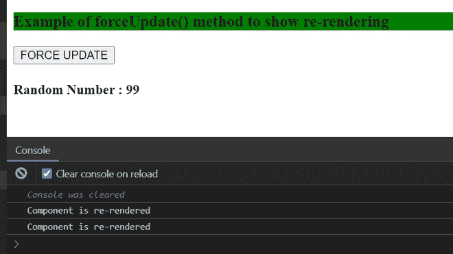

# ReactJS 中的 forceUpdate 和 render 有什么区别？

> 原文:[https://www . geesforgeeks . org/force update-vs-render-in-reactjs/](https://www.geeksforgeeks.org/whats-the-difference-between-forceupdate-vs-render-in-reactjs/)有何区别

**render():** 在 React 中，render()方法在使用类 Component 时最为重要。没有这个方法，类组件就不能返回值。所有的 HTML 代码都写在 render()方法中。render()是 React 组件生命周期方法的一部分。它在不同的应用阶段被调用。例如当组件第一次制造或准备好时。

**示例:**

## App.js

```
import React,{ Component } from 'react';

class App extends Component {
 render() {
   return (    
     <div>
        <h1 style={{color: "green"}}>
           Learn React from GFG!!
        </h1>
     </div>
    )
  }
}

export default App;
```

**输出:**


**forceUpdate():** 在 React 中，当组件的道具和状态改变时，组件会自动重新渲染，但当组件依赖于状态和道具之外的一些数据时。在这种情况下，调用 forceUpdate 来告知组件需要重新呈现。调用 forceUpdate()将强制重新呈现该组件，从而调用组件上的 render()方法，跳过 shouldComponentUpdate()方法。

**示例:**

## App.js

```
import React from 'react';
class App extends React.Component{
  forceUpdateHandler=()=>{
    this.forceUpdate();
  };

  render(){
   console.log('Component is re-rendered');
    return(
      <div>
       <h3 style={{backgroundColor: "green"}>
        Example of forceUpdate() 
        method to show re-rendering
       </h3>
        <button onClick= {this.forceUpdateHandler} >
         FORCE UPDATE
        </button>
        <h4>Random Number :  
           { Math.floor(Math.random() * (100 - 1 +1)) + 1 }
        </h4>
      </div>
    );
  }
}

export default App;
```

**输出:**



强制更新

【forceUpdate vs render 的区别:

<figure class="table">

| **render()** | **force update()** |
| 在以下条件下调用此方法:

*   When a component is instantiated.
*   Or when the status props are updated.

 | Called when some data other than state or props change. |
| It does not skip any life cycle methods. | It skips the lifecycle shouldComponentUpdate method. |
| Not callable by users. | Call it manual. |
| It will be automatically re-rendered when needed. | It effectively re-renders the component. |
| Force to use, because this is the only method required in the Class component. | Not recommended. Should be avoided. |

</figure>