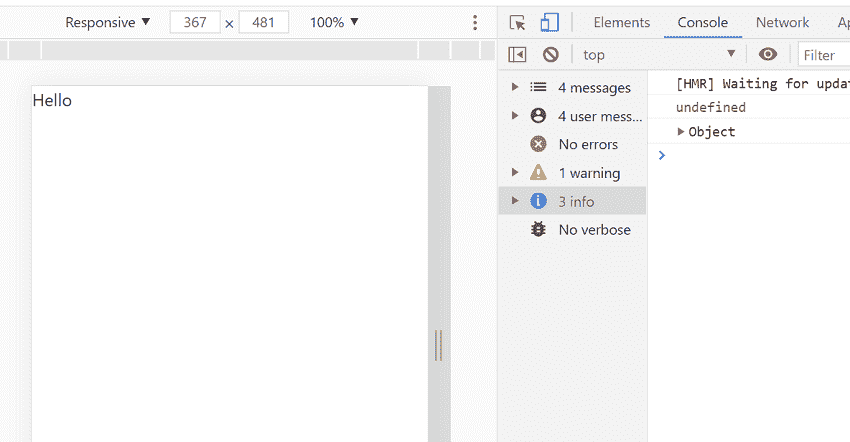
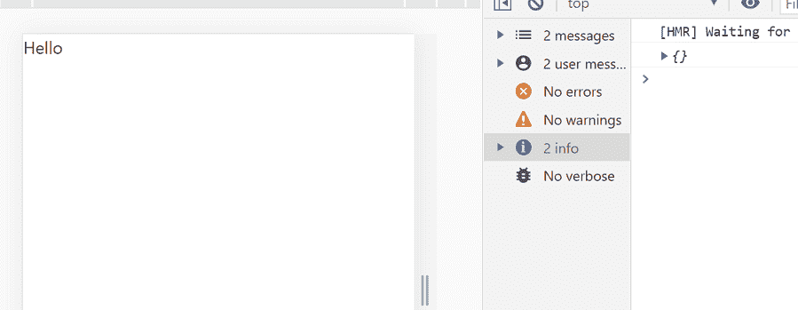

# React 中 super()和 super(道具)有什么区别？

> 原文:[https://www . geeksforgeeks . org/super-and-super-rops-in-react/](https://www.geeksforgeeks.org/whats-the-difference-between-super-and-superprops-in-react/)有什么区别

在深入主要区别之前，让我们先了解一下什么是 **Super()** 和**道具**，如下图:

*   **Super():** 用于调用其父类的构造函数。当我们需要访问其父类的一些变量时，这是必需的。
*   **道具:**是 react 中用来代表属性的特殊关键词。用于将数据从一个组件传递到另一个组件。Props 数据是只读的，这意味着来自父组件的数据不应被子组件更改。

**关键字“this”:**这个 JavaScript **这个**关键字指的是它所属的对象。

**创建反应应用程序:**

**步骤 1:** 使用以下命令创建一个反应应用程序:

```
npx create-react-app foldername
```

**步骤 2:** 在创建项目文件夹(即文件夹名**)后，使用以下命令将**移动到该文件夹:

```
cd foldername
```

**项目结构:**如下图。


项目结构

**Super()示例:**演示使用 **Super()** 功能的简单组件。

**文件名-App.js:**

## java 描述语言

```
import React from 'react'

class MyComponent extends React.Component {
  constructor(props) {
    super()
    console.log(this.props) // Undefined 
    console.log(props)     // Defined Props Will Be Logged 
  }

render() {
    return <div>Hello {this.props.message}</div>; // Defined
  }
}

export default MyComponent;
```

**运行应用程序的步骤:**从项目的根目录使用以下命令运行应用程序:

```
npm start
```

**输出:**现在打开浏览器，转到***http://localhost:3000/***，会看到如下输出:



**说明:**这里当我们在 super()中没有使用道具的时候，那么在 console 中做 c *onsole.log(this.props)* 的时候，我们会得到一个 *undefined* 的消息，因为我们在构造器里面使用的是 *this.props* 。但是如果我们只是 *console.log(props)* 这将在网页上的控制台中给我们一个适当的消息。

**Super(道具)示例:**演示使用 **Super(道具)**功能的简单组件。

**文件名-App.js:**

## java 描述语言

```
import React from 'react'

class MyComponent extends React.Component {
  constructor(props) {
    super(props)
    console.log(this.props) // {name:'Bob' , .....} Props Will Be Logged 
  }

  render() {
    return <div>Hello {this.props.message}</div>; // defined
  }
}

export default MyComponent;
```

**运行应用程序的步骤:**从项目的根目录使用以下命令运行应用程序:

```
npm start
```

**输出:**现在打开浏览器，转到***http://localhost:3000/***，会看到如下输出:



**说明:**如果要在构造函数中使用*这个*，需要传递给 super。如果我们想在构造函数中使用 *this.props* ，我们需要用 super()函数传递它。否则，我们不想因为看到*这个就把道具传给 super()。道具*在渲染功能内部可用。

```
Note: Outside Constructor() Both will display same value for 'this.props'
```