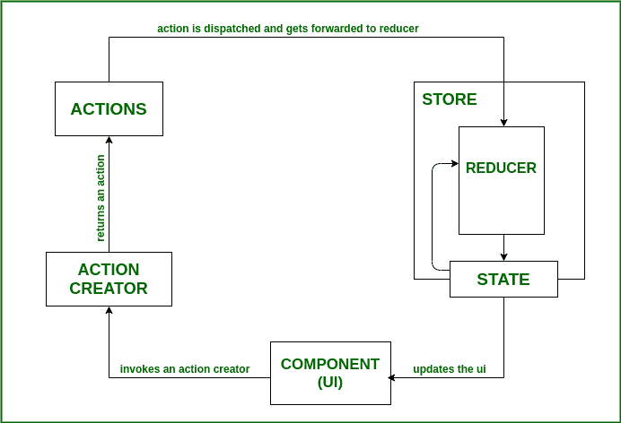
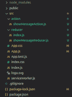
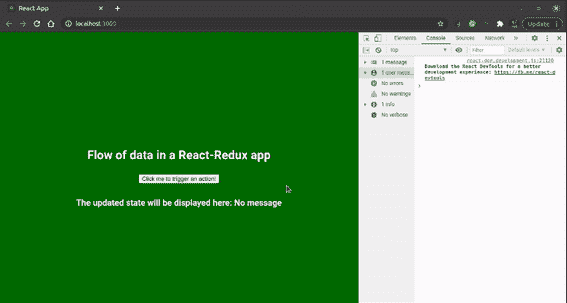

# 在 React with Redux 应用程序中，典型的数据流是什么样的？

> 原文:[https://www . geeksforgeeks . org/什么是典型的数据流量-像是在与 redux-app 发生反应/](https://www.geeksforgeeks.org/whats-the-typical-flow-of-data-like-in-a-react-with-redux-app/)

Redux 是一个开源的状态管理 JavaScript 库，用于管理应用程序状态。它被广泛使用 ReactJS，但不限于此，也可以与 Angular 等其他 JavaScript 库一起使用。在传统的 React-Redux 应用程序中，只有一个存储和一个根缩减器。随着应用程序变得越来越复杂，根缩减器被拆分成更小的缩减器，它们在状态树的不同部分上运行。

对于大规模生产级应用程序，如果应用程序的状态得不到有效管理且无法控制，重现问题并添加新功能将是一项复杂的任务。Redux 通过简化状态更新过程来降低代码的复杂性。

### 反应还原应用程序中的数据流

有四个基本概念控制 React-Redux 应用程序中的数据流。

1.  **Redux 存储:**Redux 存储，简单来说就是保存应用程序状态的对象。redux 存储可以由组合成一个大对象的小状态对象组成。应用程序中的任何组件都可以通过 connect 方法连接到这个状态(存储)来轻松访问它。
2.  **动作创建者:**动作创建者，顾名思义就是返回动作(对象)的函数。当用户通过应用程序的用户界面(按钮点击、表单提交等)或在组件生命周期的特定点(组件安装、组件卸载等)与应用程序交互时，会调用动作创建器。
3.  **动作:**动作是简单的对象，通常有两个属性——类型和负载。type 属性通常是一个指定标识操作的字符串，而 payload 是一个可选属性，包含执行任何特定任务所需的一些数据。动作的主要功能是将数据从应用程序发送到 Redux 存储。
4.  **Reducers:** Reducers 是纯函数，用于响应动作更新应用程序的状态。减少器将以前的状态和动作作为输入，并返回该状态的修改版本。因为状态是不可变的，所以缩减器总是返回一个新的状态，这是先前状态的更新版本。



反应-还原应用程序流程

*   当用户与应用程序用户界面交互时，React-Redux 应用程序中的数据流从组件级别开始。这种交互导致动作创建者调度一个动作。
*   当一个动作被分派时，它被应用程序的根缩减器接收，并被传递给所有的缩减器。因此，减速器的任务是根据调度的动作确定是否需要更新状态。
*   通过使用简单的 switch 语句过滤掉所需的操作来检查这一点。应用程序中的每个(较小的)缩减器都接受调度的操作，如果调度的操作的类型匹配，它将返回一个新更新的状态。
*   这里需要注意的是，redux 中的状态实际上从未改变。相反，缩减器总是生成一个新的状态，它是旧状态的副本，但有一些修改。
*   然后，存储将新状态通知给组件，组件又检索更新的状态并重新呈现组件。
*   这里的另一个重要观察是，React-Redux 应用程序中的数据流是单向的，也就是说，它只朝一个方向流动。

**创建反应应用程序:**

*   **步骤 1:** 使用以下命令创建一个反应应用程序:

    ```jsx
    npx create-react-app react-with-redux
    ```

*   **步骤 2:** 创建项目文件夹(即 react-with-redux)后，使用以下命令移动到该文件夹:

    ```jsx
    cd react-with-redux
    ```

**项目结构:**如下图:



**示例:**现在在 App.js 文件中写下以下代码。在这里，App 是我们编写代码的默认组件。

## App.js

```jsx
import React, { Component } from "react";
import "./App.css";
import { GetMessage } from "./action/showMessageAction";
import { connect } from "react-redux";
class App extends Component {
  showMessage = () => {
    console.log("CALLING ACTION");
    this.props.getMessage();
  };

  render() {
    return (
      <div className="App">
        <header className="App-header">
          <h3>Flow of data in a React-Redux app</h3>
          <button onClick={this.showMessage}>
            Click me to trigger an action!{" "}
          </button>
          <h5>
            The updated state will be displayed here: {this.props.message}
          </h5>{" "}
        </header>
      </div>
    );
  }
}

const mapActionsToProps = {
  getMessage: GetMessage,
};

const mapStateToProps = (state) => {
  return { message: state.data.message };
};

export default connect(mapStateToProps, mapActionsToProps)(App);
```

## reduce/index . js

```jsx
import { combineReducers } from "redux";
import showMessageReducer from "./showMessageReducer";

const combinedReducers = combineReducers({ data: showMessageReducer });

export default combinedReducers;
```

## showMessageAction.js：

```jsx
export const SHOW_MESSAGE = "SHOW_MESSAGE";

export const GetMessage = () => {
  console.log("DISPATCHING ACTION");
  return {
    type: SHOW_MESSAGE,
    payload: { message: "Hello from GeeksforGeeks!" },
  };
};
```

## showmessagereducer.js 文件

```jsx
import { SHOW_MESSAGE } from "../action/showMessageAction";

const showMessageReducer = (
  state = { message: "No message" },
  { type, payload }
) => {
  switch (type) {
    case SHOW_MESSAGE:
      console.log("STATE UPDATION");
      return payload;

    default:
      return state;
  }
};

export default showMessageReducer;
```

**运行应用程序的步骤:**从项目的根目录使用以下命令运行应用程序:

```jsx
npm start
```

**输出:**

