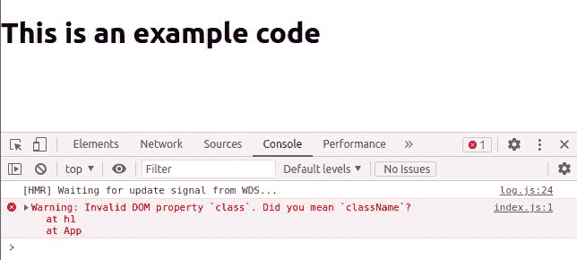
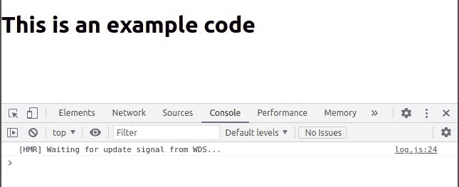

# 【React 为什么使用类名而不是类属性？

> 原文:[https://www . geesforgeks . org/why-react-uses-class name-over-class-attribute/](https://www.geeksforgeeks.org/why-react-uses-classname-over-class-attribute/)

所有常规的 DOM 和 SVG 元素，如<button>、*   ,</button> 

事实上，在 React 16 之前的早期，如果你用 React 不能识别的未知元素写 JSX，它会直接跳过。**例如:**

```jsx
<div myatrribute="xyz" />
```

上面的代码行将向 React 15 中的 DOM 呈现一个空 div，

```jsx
// React 15 output
<div />
```

但是在 React 16 中，这个未知的属性“xyz”也会出现在 DOM 中。

```jsx
// React 16 output
<div myatrribute="xyz" />
```

这就是为什么，在 React 15 中，当你使用 ***类*** 给任何元素指定一个 css 类时，它只会警告你而忽略它。但是现在由于 React 16 中新的 DOM 属性处理，它仍然**警告**但是将值转换成字符串并传递它们。

**创建反应应用程序:**

**步骤 1:** 使用以下命令创建一个反应应用程序:

```jsx
npx create-react-app foldername
```

**步骤 2:** 创建项目文件夹(即文件夹名**)后，使用以下命令移动到该文件夹中:**

```jsx
cd foldername
```

**项目结构:**如下图。


项目结构

**示例 1:** 现在，让我们通过一些实际的实现来理解这一点，假设我们简单地从我们的默认组件 App.js 中渲染一个标题< h1 >，在其内部 HTML 中包含一些文本。

## App.js

```jsx
import "./App.css";

function App() {
  return <h1 class="heading1">This is an example code</h1>;
}

export default App;
```

**输出:**在上面的代码中，我们使用了 ***类*** 而不是 ***类名*** ，因此在控制台中，我们收到了一条警告，上面写着:“**无效的 DOM 属性‘class’，您是指‘class name’吗？**“但是它只在 React 16 中警告你，这就是为什么上面代码中的输出没有受到它的影响。



**示例 2:** 您可以通过简单地使用**类名**代替**类**来消除上述示例的警告，如下例所示:

## App.js

```jsx
import "./App.css";

function App() {
  return <h1 className="heading1">This is an example code</h1>;
}

export default App;
```

**输出:**



**解释:**之所以使用 className 而不是 class，唯一的原因是 ***类*** 是 JavaScript 中的保留关键字，由于我们在 React 中使用了 JSX，而本身就是 JavaScript 的扩展，所以我们不得不使用 className 而不是 class attribute。然而，很少有给定 HTML 属性的 DOM 属性使用不同名称的情况。例如，将类命名为类名。但是没有任何改变，类名和类的语义是一样的，当 JSX 被渲染时，类名属性被自动渲染为类属性。