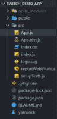
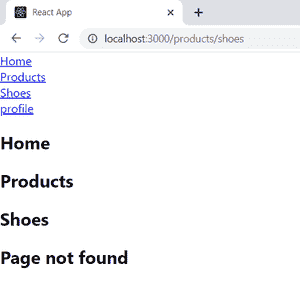
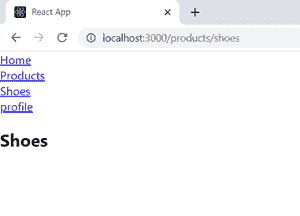

# 为什么在 React Router v4 中使用 switch 关键字？

> 原文:[https://www . geesforgeks . org/why-switch-关键字-in-react-router-v4/](https://www.geeksforgeeks.org/why-switch-keyword-used-in-react-router-v4/)

[ReactJS](https://www.geeksforgeeks.org/reactjs-tutorials/) 是一个 javascript 库，用于构建单页应用程序(SPA)。默认情况下，React 不提供路由功能。我们可以在 ReactJS 项目中使用 [React Router](https://www.geeksforgeeks.org/reactjs-router/) 实现路由。React Router 是一个库，它支持在 React 应用程序中各种组件的视图之间进行导航，允许更改浏览器 URL，并使用户界面与 URL 保持同步。

在本文中，我们将了解路由如何在 React Router 中工作，以及如何利用 React Router 提供的交换机组件。

**创建反应应用程序并安装模块:**

**步骤 1:** 使用以下命令创建一个 React 应用程序。

```
npx create-react-app SWITCH_DEMO_APP
```

**步骤 2:** 创建项目文件夹后，使用以下命令移动到该文件夹。

```
cd SWITCH_DEMO_APP
```

**步骤 3:** 创建 React 应用程序后，使用以下命令将 React 路由器作为依赖项安装。

```
npm install --save react-router-dom
```

**项目结构:**删除部分非必需文件后的项目结构如下图所示。



项目结构

**示例 1:不带交换机组件的路由–**当我们使用 React Router 执行路由时，无论何时呈现页面，URL 路径都将与每条路由相匹配。所有匹配给定网址路径的路由路径都会被呈现。App.js 文件的内容如下。在这个文件中，我们创建了四个 div，每个 div 包含一个由 React Router 提供的链接组件。我们还创建了五条路线，即主页、个人资料、产品、产品/鞋子，以及一条路径等于 a *的路线，该路线是与每个网址路径匹配的通配符。

**React Router 中的路径匹配是如何工作的？**

React 路由器获取相对 URL，并将其与路由组件中提供的每个路径进行匹配。路线匹配的方式是，如果匹配了该相对网址的一部分，则呈现该路线。例如，如果相对 URL 为**/产品/鞋子**，则路径 **/** 、**/产品**、**/产品/鞋子**与 URL 匹配，并且渲染所有三条路线，但是**/配置文件**与 URL 不匹配。

**文件名:App.js**

## java 描述语言

```
import React, { Fragment } from "react";
import { BrowserRouter as Router, Link, 
    Route } from "react-router-dom";

const Home = () => {
  return <h2>Home</h2>;
};

const Profile = () => {
  return <h2>Profile</h2>;
};

const Shoes = () => {
  return <h2>Shoes</h2>;
};

const Products = () => {
  return <h2>Products</h2>;
};

const App = () => {
  return (
    <Fragment>
      <Router>
        <div>
          <Link to="/">Home</Link>
        </div>
        <div>
          <Link to="/products">Products</Link>
        </div>
        <div>
          <Link to="/products/shoes">Shoes</Link>
        </div>
        <div>
          <Link to="/profile">profile</Link>
        </div>
        <Route path="/">
          <Home />
        </Route>
        <Route path="/profile">
          <Profile />
        </Route>
        <Route path="/products">
          <Products />
        </Route>
        <Route path="/products/shoes">
          <Shoes />
        </Route>
      </Router>
    </Fragment>
  );
};

export default App;
```

**运行应用程序的步骤:**从项目的根目录使用以下命令运行应用程序。

```
npm start
```

**输出:**点击‘鞋子’链接时显示网页的图片。



**示例 2:使用交换机组件进行路由–**当我们将我们的路由包装在交换机组件中时，它会确保一次只呈现一条路由。因此，在这种情况下，第一条路由将相对网址与每个路由组件的路径相匹配，并且只呈现与相对网址的一部分相匹配的第一条路径，如上所述。

**语法:**使用 Switch 组件的语法如下。

```
<Switch>
  <Route exact path='/'>
      <A />
  </Route>
  <Route path='/b'>
      <B />
  </Route>
  <Route exact path='/c'>
      <C />
  </Route>
  <Route path='/d'>
      <D />
  </Route>
</Switch>
```

如果两条路线相互匹配，那么我们可以使用如下所示的[精确的](https://reactrouter.com/web/api/NavLink/exact-bool)道具。

```
<Route exact path='/'>
    <Home />
</Route>
```

通过使用这个精确的道具，我们确保只有当相对网址与 **/** 完全匹配时，才会渲染回家路线。现在，如果相对网址是**/配置文件**，那么在代码中，如果配置文件路由位于 **/** 路由下方，则仅渲染配置文件路由并不重要。下面是我们使用 Switch 组件时 App.js 文件的内容。

**文件名:App.js**

## java 描述语言

```
import React, { Fragment } from 'react';
import { BrowserRouter as Router, 
  Link, Route, Switch } from 'react-router-dom';

const Home = () => {
  return <h2>Home</h2>;
};

const Profile = () => {
  return <h2>Profile</h2>;
};

const Shoes = () => {
  return <h2>Shoes</h2>;
};

const Products = () => {
  return <h2>Products</h2>;
};

const App = () => {
  return (
    <Fragment>
      <Router>
        <div>
          <Link to='/'>Home</Link>
        </div>
        <div>
          <Link to='/products'>Products</Link>
        </div>
        <div>
          <Link to='/products/shoes'>Shoes</Link>
        </div>
        <div>
          <Link to='/profile'>profile</Link>
        </div>
        <Switch>
          <Route exact path='/'>
            <Home />
          </Route>
          <Route path='/profile'>
            <Profile />
          </Route>
          <Route exact path='/products'>
            <Products />
          </Route>
          <Route path='/products/shoes'>
            <Shoes />
          </Route>
        </Switch>
      </Router>
    </Fragment>
  );
};

export default App;
```

**运行应用程序的步骤:**从项目的根目录使用以下命令运行应用程序。

```
npm start
```

**输出:**使用 Switch 组件点击“鞋子”链接时显示网页的图片

