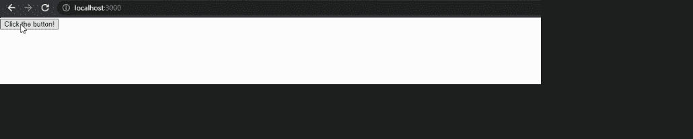

# 编写代码在 ReactJS

中渲染按钮

> 原文:[https://www . geesforgeks . org/write-a-code-to-render-a-button-in-reactjs/](https://www.geeksforgeeks.org/write-a-code-to-render-a-button-in-reactjs/)

React 是一个 UI 库。它呈现用 JSX 书写的组件。您可以根据自己的使用情况构建和呈现任何组件。

**方法:**让我们创建一个 React 项目，然后我们将创建一个呈现按钮的 UI。用户可以与用户界面进行交互，并点击按钮来触发一个事件。

**创建反应项目:**

**步骤 1:** 要创建 react app，需要通过 npx 命令安装 react 模块。使用“Npx”而不是“npm”，因为在应用程序的生命周期中，您只需要一次该命令。

```
npx create-react-app project_name
```

**第 2 步:**创建反应项目后，移动到文件夹中执行不同的操作。

```
cd project_name
```

**项目结构:**运行上述步骤中提到的命令后，如果在编辑器中打开项目，可以看到类似的项目结构，如下图所示。用户创建的新组件或我们将要执行的代码更改将在源文件夹中完成。


项目 _ 结构

我们将创建一个按钮，当您单击该按钮时，它会发送一条欢迎消息，即警报。

## App.js

```
import React from "react";

class App extends React.Component {
 call() {
   alert("Welcome to Geeks for Geeeks!");
 }
 render() {

   // Rendering a button
   return (
     <button onClick={this.call}>Click the button!</button>
   );
 }
}

export default App;
```

**运行应用程序的步骤:**打开终端，键入以下命令。

```
npm start
```

**输出:**打开浏览器。默认情况下，它将打开一个运行 localhost 的选项卡(http://localhost:3000/)，您可以看到图像中显示的输出。点击按钮查看欢迎信息。

