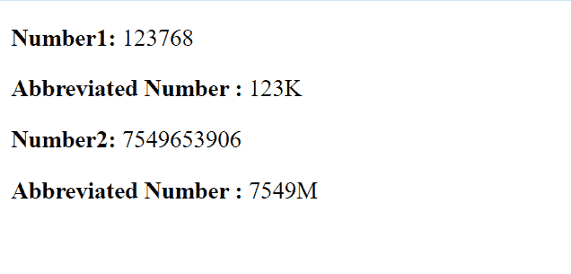

# 使用 Vue.js 中的过滤器将数字缩写为千(K)和百万(M)

> 原文:[https://www . geeksforgeeks . org/缩写-number-in-kilk-and-million-using-filter-vue-js/](https://www.geeksforgeeks.org/abbreviate-number-in-kilok-and-millionm-using-filter-vue-js/)

在本文中，我们将学习如何在 VueJS 中使用过滤器来缩写数字。过滤器是 Vue 组件提供的一项功能，允许您对模板动态数据的任何部分应用格式和转换。

过滤器是 Vue 组件提供的一项功能，允许您对模板动态数据的任何部分应用格式和转换。组件的筛选器属性是一个对象。单个过滤器是接受一个值并返回另一个值的函数。返回值是实际打印在 Vue.js 模板中的值。

以千(K)和百万(M)为单位的数字缩写可以使用过滤器来执行。我们首先检查所有的数字是否小于或大于一百万。这可以通过使用简单的数学逻辑或通过将其转换为字符串来计算数字的长度来实现。如果这个数字小于 100 万，那么我们用 1000 除它，否则，我们用 1000000 除这个数字，并返回它的最低值和所需的缩写。

**示例:**

## index.html

```js
<html>
<head>
    <script src=
"https://cdn.jsdelivr.net/npm/vue@2/dist/vue.js">
    </script>
</head>
<body>
    <div id='parent'>
        <p><strong>Number1: </strong>
          {{number1}}
        </p>
        <p><strong>
          Abbreviated Number : </strong>
          {{ number1 | abbr }}
        </p>
        <p><strong>
          Number2: </strong>{{number2}}
        </p>
        <p><strong>
          Abbreviated Number : </strong>
          {{ number2 | abbr }}
        </p>
    </div>
    <script src='app.js'></script>
</body>
</html>
```

## app.js

```js
const parent = new Vue({
    el: '#parent',
    data: {
        number1: 123768,
        number2: 7549653906
    },

    filters: {
        abbr: function(num) {
            if (String(num).length < 7) {
                return Math.floor(num/1000) + 'K';
            } else {
                return Math.floor(num/1000000) + 'M';
            }
        }
    }
})
```

**输出:**

