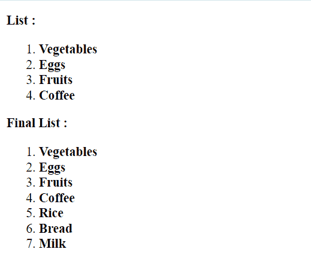

# 使用 Vue.js 中的过滤器将元素添加到数组的末尾

> 原文:[https://www . geeksforgeeks . org/向数组末尾添加元素-使用过滤器-in-vue-js/](https://www.geeksforgeeks.org/adding-elements-to-the-end-of-the-array-using-filters-in-vue-js/)

在本文中，我们将学习如何在 VueJS 中向数组末尾添加元素。Vue 是一个用于构建用户界面的进步框架。过滤器是 Vue 组件提供的一项功能，允许您对模板动态数据的任何部分应用格式和转换。组件的筛选器属性是一个对象。单个过滤器是接受一个值并返回另一个值的函数。返回值是实际打印在 Vue.js 模板中的值。

在数组末尾添加元素可以通过在所需的数组上应用过滤器来执行。我们使用数组的其余参数向数组中添加不定数量的项。扩展语法用于先扩展现有列表项，然后在末尾添加新项。这将产生一个新的数组，该数组包含旧的元素以及新的必需元素。

我们不能用传统的方法在循环中调用 vue 过滤器。我们不得不称 Vue 过滤器为对象过滤器的一种方法。

**语法:**在 vue 循环中调用过滤器。

```
$options.filters.addLast(data, other_parameters)
```

**示例:**在本例中，我们在数组上循环，并将它们显示为项目列表。类似地，当我们试图在添加新项目后列出最终的数组列表时，我们必须调用 Vue 循环中所需的过滤器，如上所述。

## index.html

```
<html>
<head>
  <script src="
https://cdn.jsdelivr.net/npm/vue@2/dist/vue.js">
  </script>
</head>
<body>
  <div id='parent'>
    <p>
      <strong>List : </strong>
      <ol>
        <li v-for='item in arr1'>
          <strong>{{item}}</strong>
        </li>
      </ol>
      <strong>Final List : </strong>
      <ol>
        <li v-for=
'item in $options.filters.addLast(arr1, ["Rice","Bread","Milk"])'>
          <strong>{{ item }}</strong>
        </li>
      </ol>
    </p>

  </div>
  <script src='app.js'></script>
</body>
</html>
```

## app.js

```
const parent = new Vue({
  el: '#parent',
  data: {
    arr1: ['Vegetables', 'Eggs', 'Fruits', 'Coffee']
  },

  filters: {
    addLast: function (arr, item_arr) {

      // Using the spread syntax to add the
      // items to the end of the array
      const final_list = [...arr, ...item_arr]
      return final_list
    }
  }
})
```

**输出:**

