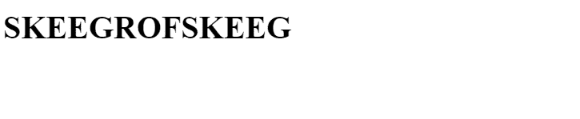
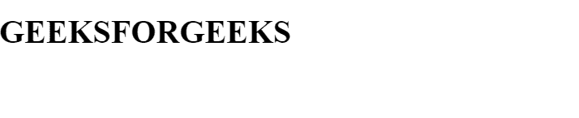

# 在虚拟仪器中添加过滤器

> 原文:[https://www.geeksforgeeks.org/adding-filters-in-vuejs/](https://www.geeksforgeeks.org/adding-filters-in-vuejs/)

一个**过滤器**是一个简单的 [JavaScript](https://www.geeksforgeeks.org/javascript-tutorial/) 函数，用来改变一个数据到浏览器的输出。[中的滤镜 **Vue。JS**](https://www.geeksforgeeks.org/vue-js-introduction-installation/) 不要在我们存储数据的地方直接更改数据，它只对我们的数据应用格式。只有当浏览器的数据输出发生变化时，数据才保持不变。 [Vue。JS](https://www.geeksforgeeks.org/vue-js-introduction-installation/) 默认不给这些滤镜，所以我们要做这些滤镜。带 [Vue。JS](https://www.geeksforgeeks.org/vue-js-introduction-installation/) ，我们可以用两种不同的方式使用滤镜，即**全局滤镜**和**局部滤镜**。全局过滤器提供对所有组件的访问，而局部过滤器只允许我们在定义它的组件内部使用我们的过滤器。

**先决条件:**T2 武学基础。JS

**方法:**下面按顺序描述了在 [Vue 中创建过滤器的所有步骤。JS。](https://www.geeksforgeeks.org/vue-js-introduction-installation/)

*   **第一步:**首先，如果我们想要一个全局过滤器，我们通过 Vue.filter()方法注册它
*   **第二步:**现在我们在 index.js 文件中添加 Vue.filter()方法。这个过滤器函数以一个值作为参数，然后返回过滤器或转换后的值。

```js
Vue.filter('uppercase', function(value));

```

*   **第三步:**该功能由 [Vue 执行。JS](https://www.geeksforgeeks.org/vue-js-introduction-installation/) 每当这个滤镜应用到某个东西的时候。这个函数将自动接收一个输入一个参数，这就是值。 [Vue。JS](https://www.geeksforgeeks.org/vue-js-introduction-installation/) 会自动将这个值传递给这个函数，这就是我们应用这个过滤器的值。
*   **步骤 4:** 现在我们返回过滤器或转换后的值。

```js
Vue.filter('uppercase', function (value) {
  return value.toUpperCase();
});

```

*   **步骤 5:** 现在转到您的模板，只需通过添加管道符号，然后添加过滤器的名称来添加过滤器。应用过滤器的语法是

```js
{{ title | filtername }}

```

下面是一个示例程序来说明上述方法:

**全局过滤:**全局过滤的范围遍及我们的 Vue app。

**示例 1** ***:*** 在下面的程序中，我们将使用全局过滤器反转给定的字符串。

**main.js**

## java 描述语言

```js
// GLOBAL FILTER
// In this example, we are 
// creating a filter which
// reverses the given string
import Vue from "vue";

// Importing App.vue
import App from "./App.vue";

// Declaration
Vue.filter("reverseString", function (value) {
    return value.split("").reverse().join("");
});

new Vue({
    render: (h) => h(App)
}).$mount("#app");
```

**app . view**

## 超文本标记语言

```js
<!--Template--> 
<template>
  <div id="app">

    <!--Applying filter-->
    <h1>{{ name | reverseString }}</h1>
  </div>
</template>

<script>
export default {
  data: function () {
    return {
      name: "GEEKSFORGEEKS",
    };
  },
};
</script>
```

**输出**



**局部过滤:**局部过滤的范围在一个组件内。

**示例 2:** 在下面的程序中，我们将使用局部过滤器将给定的字符串更改为大写。

**app . view**

## java 描述语言

```js
<!-- Local filter in VueJS -->
<!-- Template -->
<template>
  <div>

    <!-- Applying Uppercase filter -->
    <h1>{{ name| uppercase }}</h1>
  </div>
</template>

<!-- Filter defined locally -->
<script>
export default {
  data: function() {
    return {
      name: "geeksforgeeks"
    };
  },
  filters: {
    uppercase: function(value) {
      return value.toUpperCase();
    }
  }
};
</script>
```

**输出**

