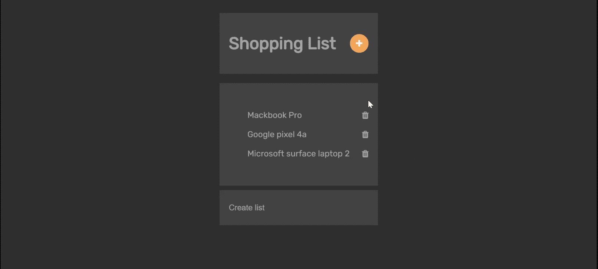

# 用 VueJS 建立购物清单

> 原文:[https://www . geesforgeks . org/building-a-shopping-list-with-vuejs/](https://www.geeksforgeeks.org/building-a-shopping-list-with-vuejs/)

下面的方法介绍了如何用 VueJs 构建一个简单的购物清单应用程序。Vue(或 Vue.js)是一个面向构建用户界面的开源 JavaScript 框架，它是由尤雨溪创建的。

**先决条件:**

*   对 HTML 有基本的了解。
*   CSS 基础知识
*   JavaScript 基础知识

**包含脚本:**我们可以使用以下 CDN 链接将 Vue Js 包含到我们的 HTML 中:

```
<script src=
    "https://cdn.jsdelivr.net/npm/vue@2.5.17/dist/vue.js">
</script>
```

**示例:**下面是一个使用 VueJS 的购物清单应用程序。

## 超文本标记语言

```
<!DOCTYPE html>
<html lang="en" dir="ltr">

<head>
    <meta charset="utf-8" />

    <!-- CDN LINK  -->
    <script src=
"https://cdn.jsdelivr.net/npm/vue@2.5.17/dist/vue.js">
    </script>

    <!-- font icon link -->
    <link rel="stylesheet" href=
"https://stackpath.bootstrapcdn.com/font-awesome/4.7.0/css/font-awesome.min.css" />
    <link rel="stylesheet" href=
"https://stackpath.bootstrapcdn.com/font-awesome/4.7.0/css/font-awesome.min.css"
        integrity=
"sha384-wvfXpqpZZVQGK6TAh5PVlGOfQNHSoD2xbE+QkPxCAFlNEevoEH3Sl0sibVcOQVnN"
        crossorigin="anonymous" />

    <!-- CSS style -->
    <style>
        @import url(
"https://fonts.googleapis.com/css2?family=Rubik&display=swap");

        #app-vue {
            display: flex;
            justify-content: center;
            font-family: "Rubik", sans-serif;
        }

        body {
            background: #313131;
            font-size: 18px;
        }

        .fa-plus {
            background-color: #fca954;
            color: #ffffff;
            width: 40px;
            height: 40px;
            display: flex;
            justify-content: center;
            align-items: center;
            border-radius: 30px;
        }

        .lists {
            width: 300px;
            display: flex;
            flex-direction: column;
            padding: 20px;
            background: #444444;
        }

        .container {
            width: 300px;
            display: flex;
            justify-content: space-between;
            align-items: center;
            padding: 20px;
            margin: 10px 0px;
            background: #444444;
            color: #aaaaaa;
        }

        .container input {
            width: 80%;
            padding: 8px 0px;
            outline: none;
            background: transparent;
            border: none;
            color: #aaaaaa;
            font-size: 17px;
        }

        ::placeholder {
            color: #aaaaaa;
        }

        .container-text {
            width: 300px;
            padding: 20px;
            margin: 20px 0px;
            background: #444444;
            color: #aaaaaa;
        }

        .text {
            display: flex;
            align-items: center;
            justify-content: space-between;
        }

        .text {
            display: flex;
            align-items: center;
            justify-content: space-between;
        }

        li {
            margin: 20px 0;
            display: flex;
            justify-content: space-between;
            align-items: center;
            color: #aaaaaa;
        }

        @media (max-width: 332px) {

            .lists,
            .container-text,
            .container {
                width: 270px;
                max-width: 250px;
            }
        }
    </style>
</head>

<body>
    <div id="app-vue">
        <main>
            <div class="container-text">
                <div class="text">
                    <h1>Shopping List</h1>
                    <span>
                        <i class="fa fa-plus" 
                            aria-hidden="true">
                        </i>
                    </span>
                </div>
            </div>
            <div class="lists">
                <ul>
                    <li v-for="(list, index) in lists" 
                        :key="index">
                        {{ list }}
                        <i class="fa fa-trash" 
                            aria-hidden="true" 
                            v-on:click="removeList(index)">
                        </i>
                    </li>
                </ul>
            </div>
            <div class="container">
                <input type="text" 
                    placeholder="Create list" 
                    v-model="currentList" 
                    v-on:keyup.enter="addList" />
            </div>
        </main>
    </div>

    <script>
        new Vue({
            el: "#app-vue",
            data() {
                return {
                    lists: [
                        "Mackbook Pro",
                        "Google pixel 4a",
                        "Microsoft surface laptop 2",
                    ],
                    currentLists: "",
                };
            },
            methods: {
                addList: function () {
                    this.lists.push(this.currentList);
                    this.currentList = "";
                },
                removeList: function (index) {
                    this.lists.splice(index, 1);
                },
            },
        });
    </script>
</body>

</html>
```

**输出:**



#### **说明:**

**HTML 代码:**这个部分包含我们的字体图标链接、创建新列表项的表单输入，以及循环遍历列表并打印它们的项的 v-for 指令。

**JavaScript 代码:**本部分包含应用的功能。这些步骤如下:

*   创建我们的 Vue 实例 Vue 实例是 Vue 应用程序的核心。
*   返回需要在视图中处理的数据。这些数据必须在数据选项中指定。
*   运行数据属性中的项目列表。
*   我们可以使用 v-for 指令基于一个数组来呈现我们的水果项目列表。
*   现在，让我们通过使用 v-model 基于输入类型更新元素来创建双向数据绑定。
*   创建一个功能，使您能够删除我们列出的每个项目。

**结论:**这是如何使用 CDN 通过静态 HTML 建立一个 Vue 项目，以及如何在 Vue 中创建一个简单的购物清单。我们了解了 Vue 实例、数据、方法、条件、事件。