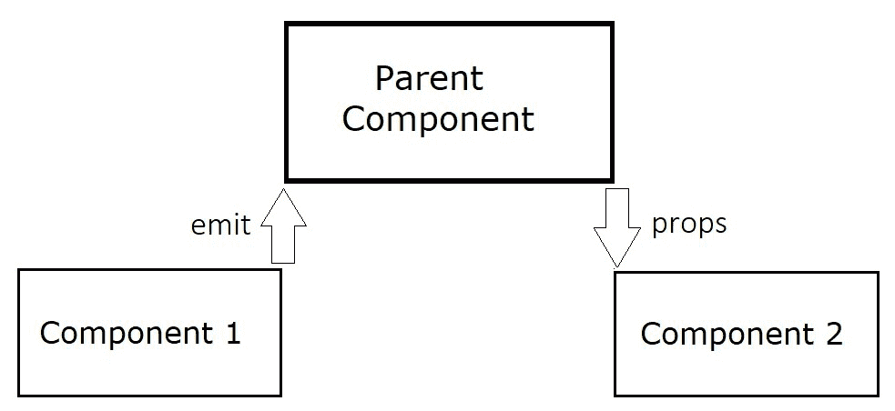
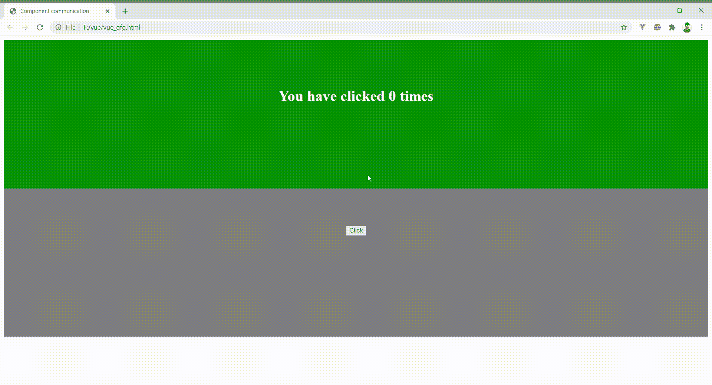

# 在 Vue.js 中使用$emit 和道具的组件之间的通信

> 原文:[https://www . geesforgeks . org/组件间通信-使用-发射-和-道具-in-vue-js/](https://www.geeksforgeeks.org/communication-between-components-using-emit-and-props-in-vue-js/)

Vue.js 中的组件有时需要相互共享数据，以便给出所需的输出。网页中的组件像树一样按层次顺序排列。组件之间交互和传递数据的最基本方式是使用$emit 和 props。

**$emit 和道具:**在 Vue.js 中，我们使用 **$emit** 为我们的组件生成自定义事件。这意味着，就像鼠标点击或滚动生成 onclick 和 onwheel 事件一样，我们可以从组件方法中生成事件，并根据我们的约定命名它们。不仅如此，我们还可以将数据作为参数传递给这个事件。

```jshtml
this.$emit('setevent',someVariable);
```

**道具**用于将数据作为自定义属性传递给组件。道具按如下方式添加到组件中–

```jshtml
Vue.component('exampleComponent',{
    props: ['sometext'],

    template : `<p>This is the prop data - {{sometext}}</p>`

});
```

**它是如何工作的？**

所以这是如何工作的，父组件监听第一个子组件的事件，然后对其执行一个方法带。此方法获取事件的数据作为参数，然后将此数据传递给第二子组件的道具。



**示例:**以下示例说明了该机制的工作原理。这是一个非常基本的网页，显示一个按钮被点击的次数。它有 3 个组件——一个父组件和两个子组件。

## 超文本标记语言

```jshtml
<!DOCTYPE html>
<html>

<head>
    <meta charset="utf-8">
    <meta name="viewport" content=
        "width=device-width, initial-scale=1">

    <!-- Including Vue using CDN-->
    <script src=
"https://cdn.jsdelivr.net/npm/vue/dist/vue.js">
    </script>

    <!-- Javascript code -->
    <script src="script.js"></script>

    <style>
        .component1 {
            display: block;
            background-color: green;
            height: 15em;
            text-align: center;
            color: white;
            padding-top: 5em;
        }

        .component2 {
            display: block;
            background-color: grey;
            height: 15em;
            text-align: center;
            padding-top: 5em;
        }
    </style>
</head>

<body>
    <div id="root">
        <parentcomponent></parentcomponent>
    </div>
</body>

</html>
```

## java 描述语言

```jshtml
/* First component has a heading element in 
   the template which shows how many times 
   the button in 2nd component has been 
   clicked. It uses props. */
Vue.component('component1', {
    props: ['labeltext'],

    // This props is then used in template 
    // to have dynamic values.
    template: `<div class="component1">
    <h1>You have clicked {{labeltext}} times</h1>
    </div>`
});

/* Second component has a button which when 
clicked upon executes the count method. A 
custom event namely ‘setevent’ is triggered 
by this method. */
Vue.component('component2', {
    data() {
        return {
            nclick: 0
        }
    },
    template: `<div class="component2">
        <button @click = "count">Click</button>
        </div>`,
    methods: {
        count() {
            this.nclick += 1;

            // Emitting a custom-event
            this.$emit('setevent', this.nclick);
        }
    }
});

// This is just a div element component which 
// contains the two child components in it.
Vue.component('parentcomponent', {
    data() {
        return {
            text: 0
        }
    },

    // Set method is binded to the 'setevent'
    // event and labeltext is the prop.
    template: `<div>
        <component1 :labeltext = "text"></component1>
        <component2  @setevent = "set"></component2>
    </div>`,
    methods: {
        set(n) {

            // Updates the variable text which 
            // is the value of prop attribute
            this.text = n;
        }
    }
});

new Vue({
    el: '#root',
    data: { }
})
```

#### 输出:



**应用和范围:**一个 Vue.js web app 中的组件是按层次顺序排列的，有很多层次，就像一棵树，组件里面有组件。使用上述方法，可以链接多个事件并爬上此树，然后使用 prop 将数据传递到下面的级别。

因此，当我们需要 2 或 3 个级别内的组件交互时，这种方法是非常合适的，但是一旦我们的 web 应用程序需要不同级别的组件之间的交互，这个过程就会变得越来越复杂，正如您所能想象的那样。这就是像 Vuex 这样的国家管理图书馆开始发挥作用的时候。但是对于基本的交互，我们使用$emit 和道具，以免把每一件小事都扔进我们的 Vuex 商店。