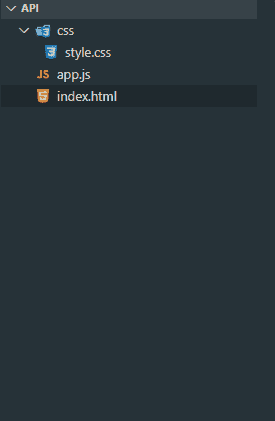
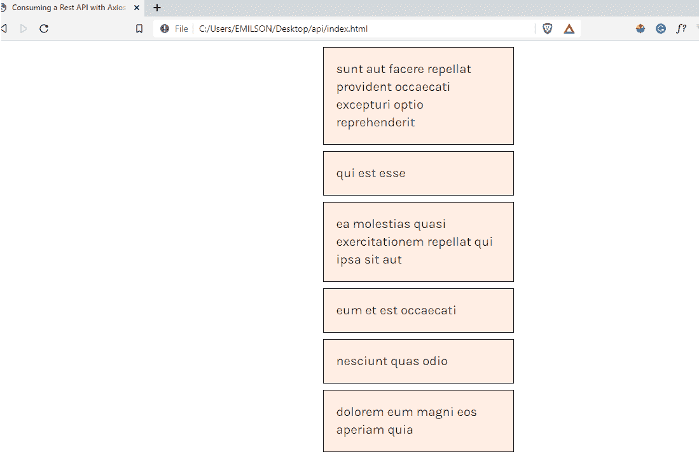

# 在 Vue.js 中使用 Axios 消费休息应用编程接口

> 原文:[https://www . geesforgeks . org/consuming-a-rest-API-with-axios-in-vue-js/](https://www.geeksforgeeks.org/consuming-a-rest-api-with-axios-in-vue-js/)

很多时候，在为 web 构建应用程序时，您可能希望使用 JavaScript fetch API、Vue resource、jquery ajax API 从 VueJS 中的 API 消费和显示数据，但一种非常流行且最推荐的方法是使用 Axios，这是一种基于承诺的 HTTP 客户端。

Axios 是一个很棒的 HTTP 客户端库。类似于 JavaScript 获取 API，默认情况下使用 Promises。它也很容易与 VueJS 一起使用。

**创建虚拟企业应用程序并安装模块:**

*   **步骤 1:** 使用以下命令创建一个 Vue 应用程序。

    ```html
    vue create vue-app
    ```

*   **步骤 2:** 使用以下命令安装 Axios 模块。

    ```html
    npm install axios 
    ```

*   **第三步:**我们可以使用以下 CDN 链接将 Vue.js 包含到 HTML 中:

    **项目目录:**会是这样的。



项目结构

## index.html

```html
<!DOCTYPE html>
<html>

<head>
    <meta charset="utf-8" />
    <script src=
"https://cdn.jsdelivr.net/npm/vue@2.5.17/dist/vue.js">
    </script>
    <script src=
"https://cdnjs.cloudflare.com/ajax/libs/axios/0.18.0/axios.js">
    </script>
    <link rel="stylesheet" href="css/style.css">
</head>

<body>
    <div id="app-vue">
        <div class="users">
            <div v-if="errored">
                <p>
                    We're sorry, we're not able to 
                    retrieve this information at the 
                    moment, please try back later
                </p>
            </div>

            <div v-else>
                <h4 v-if="loading">
                    Loading...
                </h4>
                <div v-for="post in posts" 
                    :key="post" class="post">
                    {{post.title}}
                </div>
            </div>
        </div>
    </div>

    <script>
        new Vue({
            el: '#app-vue',
            data() {
                return {
                    posts: null,
                    loading: false,
                    errored: false
                }
            },
            created() {

                // Creating loader
                this.loading = true;
                this.posts = null

                axios.get(
        `http://jsonplaceholder.typicode.com/posts`)
                    .then(response => {

                        // JSON responses are 
                        // automatically parsed
                        this.posts = response.data
                    })

                    // Dealing with errors
                    .catch(error => {
                        console.log(error)
                        this.errored = true
                    })
            }
        });
    </script>
</body>

</html>
```

## style.css

```html
#app-vue {
    display: flex;
    justify-content: center;
    font-family: 'Karla', sans-serif;
    font-size: 20px;
}

.post {
    width: 300px;
    border: 1px solid black;
    display: flex;
    flex-direction: row;
    padding: 20px;
    background: #FFEEE4;
    margin: 10px;
}
```

**运行应用程序的步骤:**如果已经安装了 Vue 应用程序，可以使用此命令运行应用程序。

```html
npm run serve 
```

**输出:**如果你使用它作为 CDN，那么复制你的 HTML 的路径并粘贴到你的浏览器上。



我们应用程序的输出

**结论:**除了消费和显示一个 API，使用 Vue 和 axios 还有很多方法。您还可以与无服务器函数通信，从您必须具有写访问权限的应用编程接口发布/编辑/删除，以及许多其他好处。