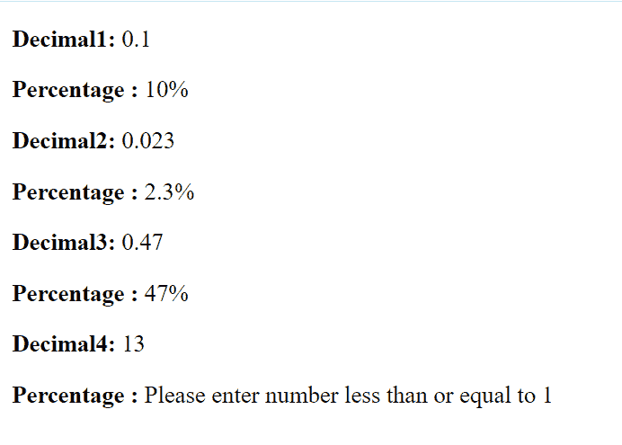

# 使用 Vue.js 中的过滤器将小数点数字转换为百分比

> 原文:[https://www . geeksforgeeks . org/convert-小数点-数字-百分比-使用过滤器-in-vue-js/](https://www.geeksforgeeks.org/convert-decimal-point-numbers-to-percentage-using-filters-in-vue-js/)

Vue 是一个用于构建用户界面的进步框架。核心库只专注于视图层，并且易于获取和与其他库集成。Vue 还完全能够结合现代工具和支持库为复杂的单页应用程序提供动力。

过滤器是 Vue 组件提供的一项功能，允许您对模板动态数据的任何部分应用格式和转换。组件的筛选器属性是一个对象。单个过滤器是接受一个值并返回另一个值的函数。返回值是实际打印在 Vue.js 模板中的值。

从十进制数到百分比值的转换可以使用过滤器来完成。过滤器的逻辑将首先检查该数字是否小于或等于 1。当用户提供大于 1 的数字时，会显示一条消息，要求用户输入一个有效的数字，否则，我们会将该数字乘以 100，并通过附加一个百分号(%)来返回。

## index.html

```js
<html>
<head>
    <script src=
"https://cdn.jsdelivr.net/npm/vue@2/dist/vue.js">
    </script>
</head>
<body>
    <div id='parent'>
        <p><strong>Decimal1: </strong>
          {{dec1}}
        </p>
        <p><strong>Percentage : </strong>
          {{ dec1 | percent }}
        </p>
        <p><strong>Decimal2: </strong>
          {{dec2}}
        </p>
        <p><strong>Percentage : </strong>
          {{ dec2 | percent }}
        </p>
        <p><strong>Decimal3: </strong>
          {{dec3}}
        </p>
        <p><strong>Percentage : </strong>
          {{ dec3 | percent }}
        </p>
        <p><strong>Decimal4: </strong>
          {{dec4}}
        </p>
        <p><strong>Percentage : </strong>
          {{ dec4 | percent }}
        </p>

    </div>
    <script src='app.js'></script>
</body>
</html>
```

## app.js

```js
const parent = new Vue({
    el: '#parent',
    data: {
        dec1: 0.1,
        dec2: 0.023,
        dec3: 0.47,
        dec4: 13
    },

    filters: {
        percent: function(dec) {
            if (dec <= 1) {
                return dec * 100 + "%";
            }
            return 'Please enter number less than or equal to 1'
        }
    }
})
```

**输出:**



使用筛选器将小数转换为百分比