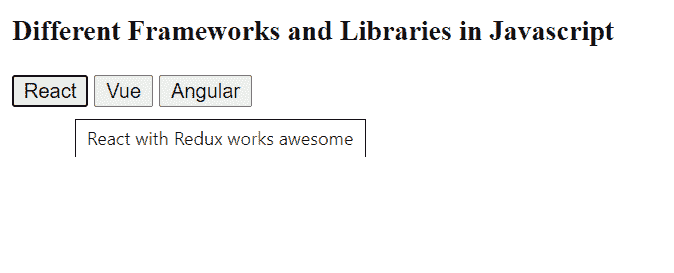

# 在 Vue.js 中创建悬停效果

> 原文:[https://www . geesforgeks . org/create-a-hover-effect-in-vue-js/](https://www.geeksforgeeks.org/create-a-hover-effect-in-vue-js/)

Vue 是一个用于构建用户界面的进步框架。核心库只专注于视图层，并且易于获取和与其他库集成。Vue 还完全能够结合现代工具和支持库为复杂的单页应用程序提供动力。

为了创建悬停效果以在悬停时获得更多信息，我们必须绑定**“title”**属性，并分配一个我们希望在 vue 元素中悬停时显示的适当标题。如果没有意义，让我们跳到这个例子中，以获得更清晰的视图。

**示例:**

**文件名:index.html**

## 超文本标记语言

```js
<!DOCTYPE html>
<html lang="en">

<head>
    <script src=
"https://cdn.jsdelivr.net/npm/vue@2/dist/vue.js">
    </script>
</head>

<body>
    <div id='parent'>
        <h3>
            Different Frameworks and 
            Libraries in JavaScript
        </h3>
        <button v-bind:title='reactMsg'>React</button>
        <button v-bind:title='vueMsg'>Vue</button>
        <button v-bind:title='angularMsg'>Angular</button>
        <script src='app.js'></script>
    </div>
</body>
</html>
```

**文件名:app.js**

## java 描述语言

```js
const parent = new Vue({
    el : '#parent',
    data : {

        // Data that interpolate in DOM
        reactMsg: "React with Redux works awesome",
        vueMsg: "Vue is a progressive framework 
                 for building user interfaces",
        angularMsg: "Angular is awesome for single 
                    page application development"
    }
})
```

**输出:**

