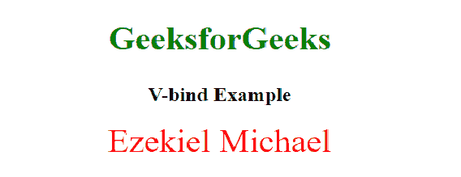

# Vue . js 中 v-bind 和 v-model 的区别

> 原文:[https://www . geesforgeks . org/v-bind-和-v-model-in-vue-js/](https://www.geeksforgeeks.org/difference-between-v-bind-and-v-model-in-vue-js/) 之间的区别

本文介绍了 [Vue.js](https://www.geeksforgeeks.org/vue-js-introduction-installation/) 中 v-model 和 v-bind 的区别。以下步骤用于解释它们的区别。

[**v 型**](https://www.geeksforgeeks.org/vue-js-two-way-binding-model/) 是双向绑定，也就是说如果你改变输入值，绑定的数据也会改变。 **v-model** 指令用于在表单输入、textarea 和 select 元素上创建双向数据绑定。

**示例:**

## 超文本标记语言

```js
<!DOCTYPE html>
<html lang="en">

<head>
    <meta charset="UTF-8">
    <meta http-equiv="X-UA-Compatible" content="IE=edge">
    <meta name="viewport" content=
        "width=device-width, initial-scale=1.0">
    <script src="https://cdn.jsdelivr.net/npm/vue@2"></script>
    <title>Difference between v-model and v-bind</title>
    <style>
        .container {
            display: flex;
            justify-content: center;
            align-items: center;

        }

        p {
            padding-left: 20px;
        }

        h1,h2 {
            text-align: center;
        }
        h1{
            color: green;
            font-size: 40px;
        }
    </style>
</head>

<body>
    <section id="app-vue">
        <h1>GeeksforGeeks</h1>
        <h2>V-Model Example</h2>
        <div class="container">
            <input type='text' v-model='Message' />
            <p> Message: {{ Message}} </p>

        </div>
    </section>

    <script>
        new Vue({
            el: '#app-vue',
            data() {
                return {
                    Message: ''
                }
            }
        });
    </script>
</body>

</html>
```

**输出:**这个例子的意思是，如果我们的数据变了，我们的输入也会变，如果我们的输入变了，我们的数据也会变。


[**v-bind**](https://www.geeksforgeeks.org/v-bind-directive-in-vue-js/) 被称为单向绑定，这意味着它单向绑定我们的数据。它也可以用来绑定 HTML 属性。这个例子展示了使用我们的 style 元素使用 **v-bind 的单向数据绑定。**

**示例:**

## 超文本标记语言

```js
<!DOCTYPE html>
<html lang="en">

<head>
    <meta charset="UTF-8">
    <meta http-equiv="X-UA-Compatible" content="IE=edge">
    <meta name="viewport" content=
        "width=device-width, initial-scale=1.0">
    <script src="https://cdn.jsdelivr.net/npm/vue@2"></script>
    <title>Difference between v-model and v-bind</title>
    <style>
        .container {
            display: flex;
            justify-content: center;
            align-items: center;
        }     

        h1,
        h2 {
            text-align: center;
        }

        h1 {
            color: green;
            font-size: 40px;
        }
    </style>
</head>

<body>
    <section id="app-vue">
        <h1>GeeksforGeeks</h1>
        <h2>V-bind Example</h2>
        <div v-bind:style="headingText">
          Ezekiel Michael
       </div>
    </section>

    <script>
        new Vue({
            el: '#app-vue',
            data: {
                headingText: {
                    color: 'red',
                    fontSize: '40px',
                    textAlign:'center'
                }
            }
        });
    </script>
</body>

</html>
```

**输出:**



下面是 v-model 和 v-bind 的区别

<figure class="table">

| **V 型** | **V-BIND** |
| V-MODEL can be changed or assigned. | Only v-bind can be assigned. |
| Type v is bi-directional binding. | V-bind is one-way binding. |
| V-model is used to bind form elements, such as input, radio button, text area and check box. | Used to bind data, attributes, expressions, classes and styles. |

</figure>