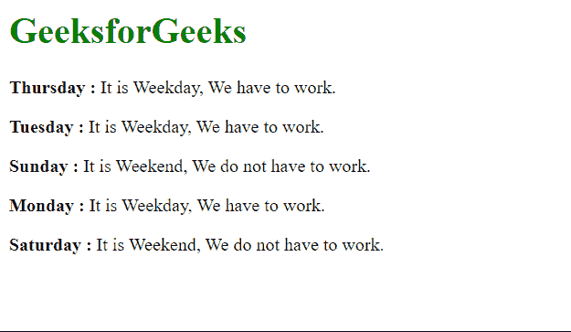

# 使用 Vue 过滤器过滤工作日和周末

> 原文:[https://www . geesforgeks . org/filling-weeks-weeks-use-vue-filters/](https://www.geeksforgeeks.org/filtering-weekdays-and-weekends-using-vue-filters/)

Vue 是一个用于构建用户界面的进步框架。核心库只专注于视图层，并且易于获取和与其他库集成。Vue 还完全能够结合现代工具和支持库为复杂的单页应用程序提供动力。

过滤器是 Vue 组件提供的一项功能，允许您对模板动态数据的任何部分应用格式和转换。组件的筛选器属性是一个对象。单个过滤器是接受一个值并返回另一个值的函数。返回值是实际打印在 Vue.js 模板中的值。

为了过滤掉一周中的工作日和周末，我们必须编写基于工作日和节假日的过滤逻辑。我们对此使用一个开关盒，并根据日期名称进行过滤。

**示例:**

## index.html

```
<html>
<head>
  <script src=
"https://cdn.jsdelivr.net/npm/vue@2/dist/vue.js">
  </script>
</head>
<body>
  <h1 style="color: green;">
    GeeksforGeeks
  </h1>
  <div id='parent'>
    <p><strong>{{day1}} : </strong> 
      {{ day1 | weeks }}
    </p>

    <p><strong>{{day2}} : </strong> 
      {{ day2 | weeks }}
    </p>

    <p><strong>{{day3}} : </strong>
      {{ day3 | weeks }}
    </p>

    <p><strong>{{day4}} : </strong>
      {{ day4 | weeks }}
    </p>

    <p><strong>{{day5}} : </strong>
      {{ day5 | weeks }}
    </p>

  </div>
  <script src='app.js'></script>
</body>
</html>
```

## app.js

```
const parent = new Vue({
  el: "#parent",
  data: {
    day1: "Thursday",
    day2: "Tuesday",
    day3: "Sunday",
    day4: "Monday",
    day5: "Saturday",
  },

  filters: {
    weeks: function (day) {

      // Using switch case to
      // decide between the days
      switch (day) {
        case "Monday":
        case "Tuesday":
        case "Wednesday":
        case "Thursday":
        case "Friday":
          return "It is Weekday, We have to work.";
        case "Saturday":
        case "Sunday":
          return "It is Weekend, We do not have to work.";
      }
    },
  },
});
```

**输出:**

