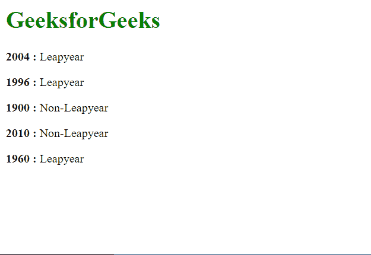

# 使用 Vue 过滤器找到 Leapyear 和 Non Leapyear

> 原文:[https://www . geeksforgeeks . org/find-leapyear-和-non-leapyear-using-vue-filters/](https://www.geeksforgeeks.org/find-leapyear-and-non-leapyear-using-vue-filters/)

Vue 是一个用于构建用户界面的进步框架。核心库只专注于视图层，并且易于获取和与其他库集成。Vue 还完全能够结合现代工具和支持库为复杂的单页应用程序提供动力。

过滤器是 Vue 组件提供的一项功能，允许您对模板动态数据的任何部分应用格式和转换。组件的筛选器属性是一个对象。单个过滤器是接受一个值并返回另一个值的函数。返回值是实际打印在 Vue.js 模板中的值。

**方法:**过滤逻辑将首先检查所需年份是否可被 100 整除。如果它是可分的，那么我们还必须用 400 来检查它的可分性。如果能被两者整除，那么指定的年份就是闰年。如果年本身不能被 100 整除，那么我们只需要检查它是否能被 4 整除。如果它是可分的，那么这一年就是闰年，否则就不是闰年。

**示例:**

## index.html

```js
<html>
<head>
    <script src=
"https://cdn.jsdelivr.net/npm/vue@2/dist/vue.js">
    </script>
</head>
<body>
  <h1 style="color: green;">
    GeeksforGeeks
  </h1>
    <div id='parent'>
        <p><strong>{{year1}} : </strong> 
          {{ year1 | leapyear }}
        </p>

        <p><strong>{{year2}} : </strong>
          {{ year2 | leapyear }}
        </p>

        <p><strong>{{year3}} : </strong>
           {{ year3 | leapyear }}
        </p>

        <p><strong>{{year4}} : </strong>
          {{ year4 | leapyear }}
        </p>

        <p><strong>{{year5}} : </strong>
          {{ year5 | leapyear }}
        </p>

    </div>
    <script src='app.js'></script>
</body>
</html>
```

## app.js

```js
const parent = new Vue({
  el: "#parent",
  data: {
    year1: 2004,
    year2: 1996,
    year3: 1900,
    year4: 2010,
    year5: 1960,
  },

  filters: {
    leapyear: function (year) {
      if (year % 100 === 0) {
        if (year % 400 === 0) {
          return "Leapyear";
        } else {
          return "Non-Leapyear";
        }
      } else {
        if (year % 4 === 0) {
          return "Leapyear";
        } else {
          return "Non-Leapyear";
        }
      }
    },
  },
});
```

**输出:**

