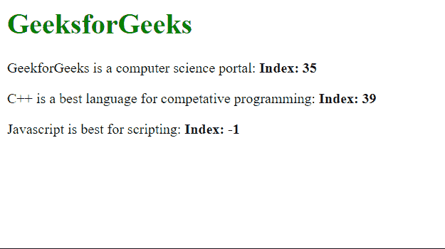

# 使用 Vue.js 过滤器找到给定字符串中特定单词的第一次出现

> 原文:[https://www . geesforgeks . org/find-给定字符串中第一个出现的特定单词-使用-vue-js-filters/](https://www.geeksforgeeks.org/find-the-first-occurrence-of-particular-word-in-a-given-string-using-vue-js-filters/)

在本文中，我们将学习如何使用 VueJS 中的过滤器来查找给定字符串中特定单词的第一次出现。Vue 是一个用于构建用户界面的进步框架。过滤器是 Vue 组件提供的一项功能，允许您对模板动态数据的任何部分应用格式和转换。组件的筛选器属性是一个对象。单个过滤器是接受一个值并返回另一个值的函数。返回值是实际打印在 Vue.js 模板中的值。

特定单词的第一次出现可以通过对所需字符串应用过滤器来找到。我们将使用 JavaScript **indexOf()** 方法来检查单词第一次出现的索引。如果单词完全匹配，则返回相应的索引，如果没有找到单词，则返回“-1”作为索引。

**示例:**

## index.html

```
<html>
<head>
  <script src=
"https://cdn.jsdelivr.net/npm/vue@2/dist/vue.js">
  </script>
</head>
<body>
  <h1 style="color: green;">
    GeeksforGeeks
  </h1>
  <div id='parent'>
    <p>{{st1}}: <strong>
        Index: {{ st1 | find('portal') }}
      </strong></p>

    <p>{{st2}}: <strong>
        Index: {{ st2 | find('programming') }}
      </strong></p>

    <p>{{st3}}: <strong>
        Index: {{ st3 | find('React') }}
      </strong></p>
  </div>
  <script src='app.js'></script>
</body>
</html>
```

## app.js

```
const parent = new Vue({
  el: "#parent",
  data: {
    st1: "GeekforGeeks is a computer science portal",
    st2: "C++ is a best language for competative programming",
    st3: "Javascript is best for scripting",
  },

  filters: {
    find: function (st, target) {
      const idx = st.indexOf(target);
      return idx;
    },
  },
});
```

**输出:**

