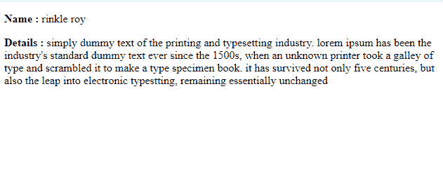

# 如何在 Vue.js 中使用过滤器将文本变成小写字符串？

> 原文:[https://www . geesforgeks . org/如何使用过滤器将文本更改为小写字符串-in-vue-js/](https://www.geeksforgeeks.org/how-to-change-text-into-lower-case-string-using-filters-in-vue-js/)

Vue 是一个用于构建用户界面的进步框架。核心库只专注于视图层，并且易于获取和与其他库集成。Vue 还完全能够结合现代工具和支持库为复杂的单页应用程序提供动力。

过滤器是 Vue 组件提供的一项功能，允许您对模板动态数据的任何部分应用格式和转换。组件的筛选器属性是一个对象。单个过滤器是接受一个值并返回另一个值的函数。返回值是实际打印在 Vue.js 模板中的值。

对于使用过滤器的小写字符串，我们必须编写逻辑来将常规字符串转换为所有小写，并将过滤器应用于所需的字符串。

**例 1:**

## index.html

```js
<!DOCTYPE html>
<html lang="en">

<head>
    <script src=
"https://cdn.jsdelivr.net/npm/vue@2/dist/vue.js">
    </script>

    <script src='app.js'></script>
</head>

<body>
    <div id='parent'>

        <p>
            <strong>Name : </strong> 
            {{ name | lowerCased }}
        </p>

        <p>
            <strong>Details : </strong> 
            {{ details | lowerCased }}
        </p>
    </div>
</body>

</html>
```

***app.js:***

## java 描述语言

```js
const parent = new Vue({
    el : '#parent',
    data : {
        name : "Rinkle ROY",
        details: "Simply duMMy TEXT OF THE PRINTING
            and tyPesETTing industry.\
            Lorem Ipsum has BEEN the industry'S 
            Standard DUMMY text EVER sINCE the 1500s,\
            when An UNknown pRInter took a gAllery 
            of type and scrambled it to make a type\
            specimen book. It has suRVIVed not 
            oNLy five centurIES, but also the leAP into \
            electronic tyPestting, remaINIng 
            eSSEntially unchanGED"
    },

    filters:{
        lowerCased : function(data){
            lower = []
            data.split(' ').forEach(word => {
                lower.push(word.toLowerCase())
            })
            return lower.join(' ')
        }
    }
})
```

***输出:***



使用过滤器下放套管柱