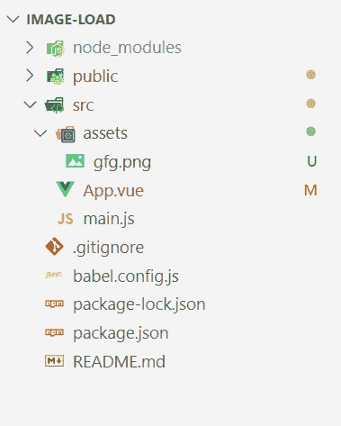
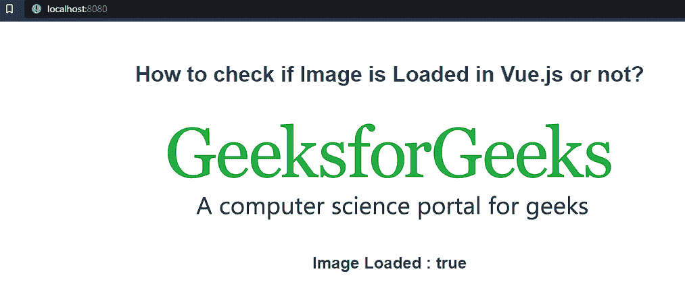

# 如何在 VueJS 中检查图像是否加载？

> 原文:[https://www . geeksforgeeks . org/如何检查加载或不加载图像/vuejs/](https://www.geeksforgeeks.org/how-to-check-an-image-is-loaded-or-not-in-vuejs/)

在 VueJS 项目中插入映像时，由于以下原因，它可能无法加载:

*   写错图片网址。
*   由于连接不良

**方法:**我们将使用< img >中的一个事件来检查 VueJS 中是否加载了图像，我们将使用的事件是:

*   **@ load:**@ load 事件在图像被加载并执行时被触发。

**项目设置:**

**步骤 1:** 在命令行中使用以下命令创建 Vue 项目:

```
vue create image-load
```

**注:**我们已经将“**影像加载**作为项目名称，您可以根据自己的选择选择任意名称。

*   将创建“图像加载”文件夹。
*   在代码编辑器中打开文件夹。

**项目结构会是这样的:**



**步骤 2:** 创建项目后，在“资产文件夹”中添加一个图像。我们添加了一张名为–‘**gfg.png**的图片

**示例:**在本例中，我们将遵循以下步骤:

1.  在本例中，我们将在应用程序的索引页面上插入一个图像。
2.  在项目“**图像加载**”中，我们创建了一个数据变量“**加载**，其默认值为“**假**”。
3.  还创建了一个“**描述”**数据变量，它保存页面的标题，即“如何检查一个图像是否加载到 VueJs 中？”。
4.  给图像分配一个“ **@load** ”事件。
5.  事件的名称将是“**加载图像**”，如果图像被加载，其功能将是将“**加载的**的值更改为“**真**”。
6.  最后，我们将在主页上打印加载的值“**，并附上图片。**

**现在让我们一步一步地看看实现。**

## **应用程序视图**

```
<template>
    <div>
        <h1>{{description}}</h1>
        <br>

        
        <h2>Image Loaded : {{isLoaded}} </h2>
    </div>
</template>

<script>
    export default {
        name: 'App',
        data() {
            return {
                description: "How to check if Image "
                    + "is Loaded in Vue.js or not?",
                isLoaded: false,
            };
        },

        methods: {
            loadImage() {
                this.isLoaded = true;
            }
        }
    }
</script>

<style>
    #app {
        font-family: Avenir, Helvetica, Arial, sans-serif;
        -webkit-font-smoothing: antialiased;
        -moz-osx-font-smoothing: grayscale;
        text-align: center;
        color: #2c3e50;
        margin-top: 60px;
    }
</style>
```

****运行应用程序:**在命令行中，输入以下命令:**

```
npm run serve
```

****输出:**打开浏览器转到 **http://localhost:8080/** 会看到如下输出:**

****

****说明:**可以看到，我们最初将**初始化为**，将**初始化为**。加载图像，加载**并为**分配一个**真**值，然后在输出过程中提取“图像加载”值并与图像一起显示。**