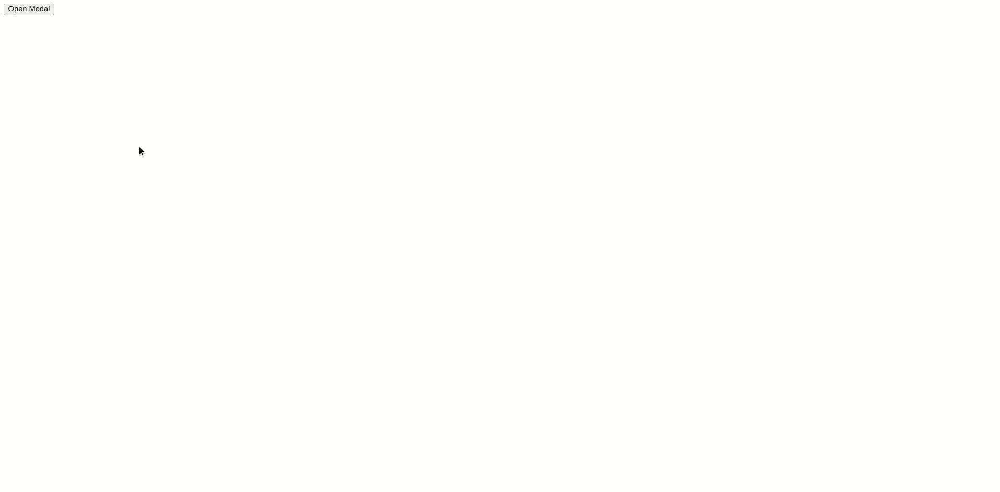

# 如何使用 vue.js 从一个按钮关闭模型？

> 原文:[https://www . geeksforgeeks . org/如何使用-vue-js/](https://www.geeksforgeeks.org/how-to-close-model-from-a-button-using-vue-js/) 按钮关闭模型

本文将告诉我们如何使用 vue.js 从一个按钮关闭一个模态，要使用 vue.js 关闭一个模态，可以使用 click 事件即 *@click* 来触发模态可见性的变化。因此，每当按下关闭按钮时，*@点击*方法将触发与该动作相关联的功能(这里，隐藏模式)。

### 句法

#### 第一步:

将 *@click="$emit('close')"* 属性添加到模式的关闭按钮。

```
<button type="button" class="close" 
    @click="$emit('close')"> X 
</button>
```

#### 第二步:

在使用模态的组件中，在数据中添加封闭模态和开放模态属性

```
data () {
     return {
       isModalVisible: false,
     };
   },
   methods: {
     showModal() {
       this.isModalVisible = true;
     },
     closeModal() {
       this.isModalVisible = false;
     }
   },
 };
```

### 示例代码:

#### 创建模态组件

## java 描述语言

```
<!--Modal.vue-->

<script>
  export default {
    name: 'modal',
  };
</script>
<template>
  <transition name="modal-fade">
    <div class="modal-backdrop">
      <div class="modal"
        role="dialog"

      >
        <header
          class="modal-header"
          id="modalTitle"
        >
          <slot name="header">
            Modal Header: GeeksforGeeks
            <button
              type="button"
              class="close"
              @click="$emit('close')" <!--Added the Click Event-->

            >
                X
            </button>
          </slot>
        </header>
        <section
          class="modal-body"
          id="modalDescription"
        >
          <slot name="body">
            Closing modal using vue.js
          </slot>
        </section>
      </div>
    </div>
  </transition>
</template>
<style>
  .modal-backdrop {
    position: fixed;
    top: 0;
    bottom: 0;
    left: 0;
    right: 0;
    background-color: rgba(133, 226, 100, 0.427);
    display: flex;
    justify-content: center;
    align-items: center;
  }

  .modal {
    background: #eeeeee;
    width: 50%;
    height: 30%;
    box-shadow: 2px 2px 20px 1px;
    overflow-x: auto;
    display: flex;
    flex-direction: column;
  }

  .modal-header{
    padding: 15px;
    display: flex;
  }

  .modal-header {
    border-bottom: 1px solid #eeeeee;
    font-size: 30px;
    color: #4AAE9B;
    justify-content: center;
  }
  .modal-body {
    position: relative;
    font-size: 30px;
    align-self: center;
    padding: 20px 10px;
  }
  .close {
    border: none;
    font-size: 30px;
    margin-left: 100px;
    cursor: pointer;
    font-weight: bold;
    color: #4AAE9B;
    background: transparent;
  }
</style>
```

#### 使用 App.vue 中的模态组件

## java 描述语言

```
<!--App.vue-->

<script>
  import modal from './components/modal.vue';

  export default {
    name: 'app',
    components: {
      modal,
    },
    data () {
      return {
        isModalVisible: false,
      };
    },
    methods: {
      showModal() {
        this.isModalVisible = true;
      },
      closeModal() {
        this.isModalVisible = false;
      }
    },
  };
</script>

<template>
  <div id="app">
    <button
      type="button"
      class="btn"
      @click="showModal"
    >
      Open Modal
    </button>

    <modal
      v-show="isModalVisible"
      @close="closeModal"
    />
  </div>
</template>
```

### 输出

