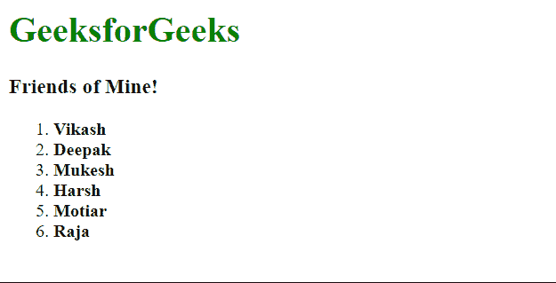
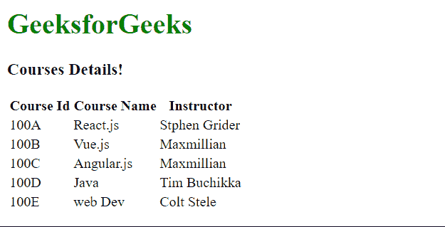

# 如何循环遍历元素列表并在 VueJS 中显示？

> 原文:[https://www . geesforgeks . org/如何循环浏览元素列表并在 vuejs 中显示它/](https://www.geeksforgeeks.org/how-to-loop-through-a-list-of-elements-and-display-it-in-vuejs/)

Vue 是一个用于构建用户界面的进步框架。核心库只专注于视图层，并且易于获取和与其他库集成。Vue 还完全能够结合现代工具和支持库为复杂的单页应用程序提供动力。

**v-for** 指令用于循环遍历元素列表。语法是项中*项的形式，其中*项*是必须循环通过的数组，*项*用作当前迭代的元素的别名。*

以下示例演示了元素的循环:

**示例 1:** 在此示例中，列表被迭代并显示。

## index.html

```js
<html>
<head>
  <script src=
"https://cdn.jsdelivr.net/npm/vue@2/dist/vue.js">
  </script>
</head>
<body>
  <div id='parent'>
    <h1 style="color: green">
      GeeksforGeeks
    </h1>
    <h3>Friends of Mine!</h3>
    <ol>
      <li v-for='friend in friends'>
        <strong>{{friend}}</strong>
      </li>
    </ol>
  </div>
    <script src='app.js'></script>
</body>
</html>
```

## app.js

```js
const parent = new Vue({
  el: '#parent',
  data: {
    friends: [
      'Vikash', 'Deepak', 'Mukesh',
      'Harsh', 'Motiar', 'Raja'
    ]
  }
})
```

**输出:**



**示例 2:** 在本示例中，包含对象的列表显示为表格。

## index.html

```js
<html>
<head>
  <script src=
"https://cdn.jsdelivr.net/npm/vue@2/dist/vue.js">
  </script>
</head>
<body>
  <div id='parent'>
    <h1 style="color: green">
      GeeksforGeeks
    </h1>
    <h3>Courses Details!</h3>
    <table>
      <tr>
        <th>Course Id</th>
        <th>Course Name</th>
        <th>Instructor</th>
      </tr>
      <tr v-for='Course in Courses'>
        <td>{{Course.CourseId}}</td>
        <td>{{Course.CourseName}}</td>
        <td>{{Course.instructor}}</td>
      </tr>
    </table>
  </div>
  <script src='app.js'></script>
</body>
</html>
```

## app.js

```js
const parent = new Vue({
    el: '#parent',
    data: {
      Courses: [
        {
          CourseId: '100A',
          CourseName: 'React.js',
          instructor: 'Stphen Grider'
        },
        {
          CourseId: '100B',
          CourseName: 'Vue.js',
          instructor: 'Maxmillian'
        },
        {
          CourseId: '100C',
          CourseName: 'Angular.js',
          instructor: 'Maxmillian'
        },
        {
          CourseId: '100D',
          CourseName: 'Java',
          instructor: 'Tim Buchikka'
        },
        {
          CourseId: '100E',
          CourseName: 'web Dev',
          instructor: 'Colt Stele'
        }
      ]
    }
})
```

**输出:**

