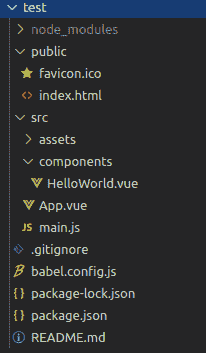
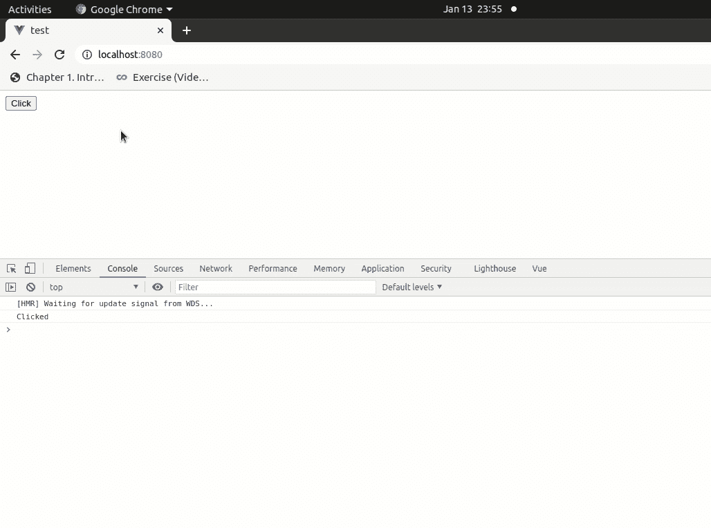

# 一旦在 vue.js 中加载了页面或视图，如何设置点击事件？

> 原文:[https://www . geesforgeks . org/如何设置一次点击事件一次页面或视图加载在 vue-js/](https://www.geeksforgeeks.org/how-to-set-a-click-event-once-a-page-or-view-is-loaded-in-vue-js/)

在本文中，我们将讨论一旦页面或视图在 vue.js 中被加载，如何设置一个点击事件。安装钩通常是最常用的钩。它们允许我们在第一次渲染之前或之后访问或修改组件的 DOM。

所以，这里我们将使用**挂载的**钩子来触发页面加载时的点击事件。

**设置环境的步骤:**

1.  首先，我们应该使用下面的命令安装 vue.js:

    ```js
    sudo npm install -g @vue/cli
    ```

2.  安装 vue.js 后，您可以使用下面的命令创建一个新项目:

    ```js
    vue create test
    ```

3.  现在，使用转到项目文件夹

    ```js
    cd myapp
    ```

4.  您可以使用以下命令运行项目:

    ```js
    npm run serve
    ```

项目的文件结构如下所示:


**语法**

*   **第一步:**给出你想要点击的按钮的参考。

    ```js
    <button ref="Btn" @click="logClicked">Click</button>
    ```

*   **第 2 步:**在**挂载**钩子触发按钮点击。

    ```js
    mounted () {
      this.$refs.Btn.click()
    }
    ```

**示例:**从测试项目 src 文件夹中打开您的 **App.vue** 文件并更新代码。

## java 描述语言

```js
<script>
export default({
  methods: {
    logClicked () {
      console.log('Clicked')
    }
  },
  mounted () {
    this.$refs.Btn.click()
  }})
</script>
<template>
<div id="app" class="container">

  <button ref="Btn" @click="logClicked">Click</button>
</div>
</template>
```

**输出**输入**本地主机:8080** 可以在 chrome 浏览器中看到输出，也可以使用下面的命令在 Chrome 浏览器中打开控制台

```js
 ctrl+shift+j
```

