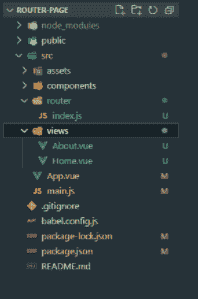

# 如何在 Vue.js 中使用路由？

> 原文:[https://www.geeksforgeeks.org/how-to-use-routing-in-vue-js/](https://www.geeksforgeeks.org/how-to-use-routing-in-vue-js/)

**[Vue 路由器:](https://www.geeksforgeeks.org/vue-js-routing/)** Vue 路由器有助于链接浏览器的网址/历史和 Vue 的组件，允许某些路径呈现与其相关联的任何视图。vue 路由器用于构建单页应用程序(SPA)。

创建新项目时，默认情况下可以设置 vue 路由器。在本文中，我们将单独安装它。所以我们可以看到它是如何工作的。

**项目设置和模块安装:**

*   **步骤 1:** Vue Router 可以通过 Npm 安装，使用下面的命令安装名为 vue-router 的包。

    ```js
    npm install vue-router // OR 
    vue add router 
    ```

    它可以通过如下所示的脚本标签来使用。

    ```js
    <script src="https://unpkg.com/vue-router"></script>
    ```

*   **步骤 2:** 使用以下命令创建我们的 Vue 项目。

    ```js
    vue create router-page 
    ```

*   **步骤 3:** 在创建我们的项目之后，我们将使用以下命令添加我们的 Vue 路由器。

    ```js
    vue add router
    ```

**项目结构:**会是这样的。



**示例:**

## main.js

```js
import Vue from 'vue'
import App from './App.vue'
import router from './router'

Vue.config.productionTip = false

new Vue({
  router,
  render: h => h(App)
}).$mount('#app')
```