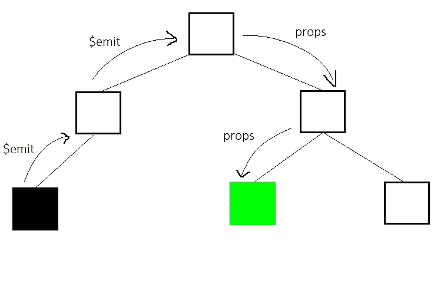
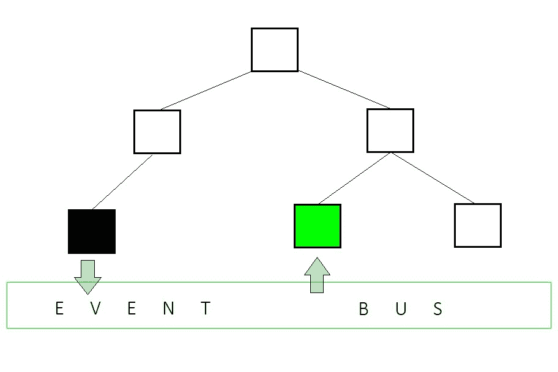
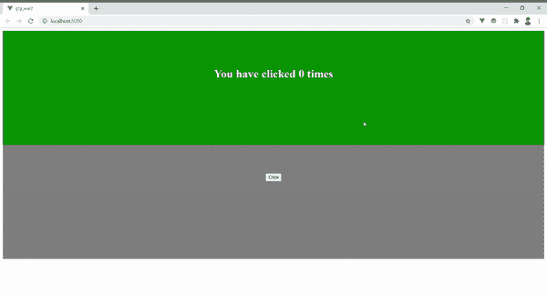

# 使用 Vue.js 事件总线在组件之间传递数据

> 原文:[https://www . geesforgeks . org/pass-数据-组件间-使用-vue-js-event-bus/](https://www.geeksforgeeks.org/pass-data-between-components-using-vue-js-event-bus/)

使用$emit 和道具时，Vue.js 中的组件通信有时会变得复杂和混乱。在真实世界的应用程序中，组件树是嵌套的并且很大，使用这种方法传递数据并不方便，因为这只会增加应用程序的复杂性，并使调试变得非常繁琐。这是一辆活动巴士出现的地方。

一个**事件总线**只不过是一个全局 Vue 实例，由参与通信和传递数据的组件导入。它利用 Vue 对象的 **$on、$emit** 和 **$off** 属性来发出事件并传递数据。事件总线为复杂的$emit 和 prop 链提供了一个非常简单和优雅的解决方案，在测试和调试过程中很难追踪到它。它充当所有相关组件的全局中介，发出和监听事件，并相应地执行方法。

**语法:**

事件总线没有特殊的语法，因为它只是 Vue 类的一个实例。

```
const EventBus = new Vue();
```

**工作:**

考虑这个简单的组件树，我们需要在黑色和绿色组件之间共享数据。使用$emit 和道具，这将是一个漫长的过程，首先使用$emit 向上传递数据和事件，然后使用道具向下传递。



然而，使用事件总线，这可以以非常简单和容易的方式实现。



**示例:**我们将使用我们用来说明$emit 和道具[的相同示例，但是这次使用的是事件总线。这是一个非常基本的网页，显示按钮被点击的次数。为此，我们有两个组件:](https://www.geeksforgeeks.org/communication-between-components-using-emit-and-props-in-vue-js/)

*   **组件 1:** 显示组件 2 中的按钮被点击的次数。
*   **组件 2:** 点击时增加计数器的按钮。

## App.js

```
<template>
<div>
  <Component1></Component1>
  <Component2></Component2>
</div>
</template>

<script>
  import Component1 from './components/Component1.vue'
  import Component2 from './components/Component2.vue'

  export default {
    name: 'App',
    components: {
      Component1,Component2
    }
  }
</script>
```

## 组件 1 .视图

```
<template>
  <div class="component1">
    <h1>You have clicked {{ labeltext }} times</h1>
  </div>
</template>

<script>
  import EventBus from '../event-bus';

  export default {
    name: "Component1",
    data() {
      return {
        labeltext: 0,
      };
    },
    methods: {
      change_n(n) {
        this.labeltext = n;
      },
    },
    created() {
        // Sets up the Event Bus listener using 
        // the custom event name and assosciates
        // it with a component method.
        EventBus.$on("change_n", this.change_n);
      },
    destroyed() {
        // Removes Event Bus listener upon removal
        // of template from DOM.
        EventBus.$off("change_n", this.change_n);
      },
  };
</script>

<style scoped>
  .component1 {
    display: block;
    background-color: green;
    height: 15em;
    text-align: center;
    color: white;
    padding-top: 5em;
  }
</style>
```

## 组件 2 .视图

```
<template>
  <div class="component2">
    <button @click="count">Click</button>
  </div>
</template>

<script>
  import EventBus from '../event-bus';

  export default {
    name: "Component2",
    data() {
      return {
        nclick : 0,
      };
    },
    methods: {
      count() {
        this.nclick += 1;
        // Emitting a custom-event via the Event Bus
        EventBus.$emit("change_n", this.nclick);
      },
    },
  };
</script>

<style scoped>
  .component2 {
    display: block;
    background-color: grey;
    height: 15em;
    text-align: center;
    padding-top: 5em;
  }
</style>
```

## 事件总线. js

```
import Vue from 'vue';

// Create a new Vue instance and export it
const EventBus = new Vue();

export default EventBus;
```

**输出:**

