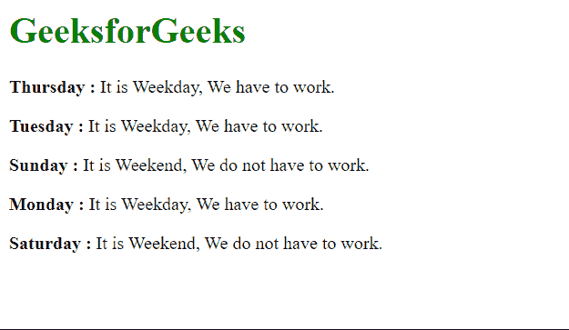

# 使用 Vue 过滤器根据其计数对数据进行复数

> Original: [https://www.geeksforgeeks.org/pluralize-data-according-to-its-count-using-vue-filters/](https://www.geeksforgeeks.org/pluralize-data-according-to-its-count-using-vue-filters/)

VUE 是用于构建用户界面的渐进式框架。 核心库仅关注于视图层，易于提取并与其他库集成。 VUE 还能够完美地支持复杂的单页应用程序，并与现代工具和支持库相结合。

过滤器是 Vue 组件提供的一种功能，它允许您对模板动态数据的任何部分应用格式和转换。 组件的 Filter 属性是一个对象。 单个筛选器是接受一个值并返回另一个值的函数。 返回值是 Vue.js 模板中实际打印的值。

为了根据计数对数据进行复数处理，我们必须编写过滤器逻辑来以单数和复数形式显示数据。 我们只需检查给定的计数是否等于 1，并根据结果决定显示单数形式还是复数形式。

**示例：**

## Index.html

```
<html>
<head>
  <script src=
"https://cdn.jsdelivr.net/npm/vue@2/dist/vue.js">
  </script>
</head>
<body>
  <h1 style="color: green;">GeeksforGeeks</h1>
  <div id='parent'>
    <p><strong>No. of item: </strong> 
      {{ c1 | pluralize('Book','Books') }}
    </p>

    <p><strong>No. of item: </strong> 
      {{ c2 | pluralize('Chair','Chairs') }}
    </p>

    <p><strong>No. of item: </strong>
      {{ c3 | pluralize('Potato Fry','Potato Fries') }}
    </p>

    <p><strong>No. of item: </strong>
      {{ c4 | pluralize('Ice Cream','Ice Creams') }}
    </p>

    <p><strong>No. of item: </strong>
      {{ c5 | pluralize('Mobile','Mobiles') }}
    </p>

  </div>
  <script src='app.js'></script>
</body>
</html>
```

## App.js

```
const parent = new Vue({
  el: "#parent",
  data: {
    c1: 1,
    c2: 5,
    c3: 100,
    c4: 10,
    c5: -9,
  },

  filters: {
    pluralize: function (count, sing, plur) {

      // Decide to pluralize based
      // on the count
      if (count == 1) {
        return count + ` ${sing}`;
      } else if (count > 1) {
        return count + ` ${plur}`;
      } else {
        return "Please pass valid count of data";
      }
    },
  },
});
```

发帖主题：Re：Колибри0.7.0

