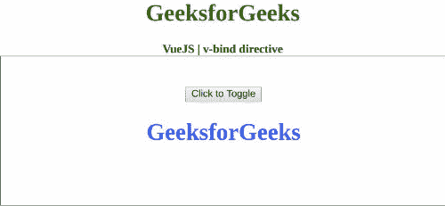

# v-bind 指令在 view . js

> 哎哎哎:# t0]https://www . geeksforgeeks . org/v-bind 指令-in-view-js/

**v-bind** 指令是一个 [**Vue.js**](https://www.geeksforgeeks.org/vue-js-introduction-installation/) 指令，用于将一个或多个属性或组件道具绑定到一个元素。如果该属性绑定到我们在 Vue 实例中定义的数据，那么随着数据的变化可以观察到动态变化。首先，我们将创建一个 id 为 *app* 的 div 元素，让我们将 *v-bind* 指令应用于一个元素。此外，我们可以使用一个按钮执行一个函数，当点击甚至发生，这将逆转数据的价值。

**语法:**

```
v-bind:attribute="expression";
```

**参数:**该指令接受将决定使用哪个属性值的表达式。

**示例:**这个示例使用 Vue.js 来切换带有 v-bind 的元素的类。此外，我们将使用 CSS 为每个类应用不同的颜色，以便我们可以看到它们的变化。

## 超文本标记语言

```
<!DOCTYPE html>
<html>

<head>

    <!-- Load Vuejs -->
    <script src=
"https://cdn.jsdelivr.net/npm/vue/dist/vue.js">
    </script>

    <style>
        .active {
            color: blue;
        }

        .error {
            color: red;
        }
    </style>
</head>

<body>
    <div style="text-align: center;width: 600px;">
        <h1 style="color: green;">
            GeeksforGeeks
        </h1>
        <b>
            VueJS | v-bind directive
        </b>
    </div>

    <div id="canvas" style=
        "border:1px solid #000000;
        width: 600px;height: 200px;">

        <div id="app" style=
            "text-align: center; 
            padding-top: 40px;">
            <button v-on:click=
                "ifActive = !ifActive">
                Click to Toggle
            </button>

            <h1 v-bind:class=
                "{active: ifActive, error: !ifActive}">
                GeeksforGeeks
            </h1>
        </div>
    </div>

    <script>
        var app = new Vue({
            el: '#app',
            data: {
                ifActive: true
            }
        })
    </script>
</body>

</html>                   
```

**输出:**

